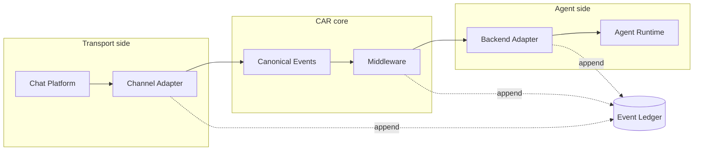
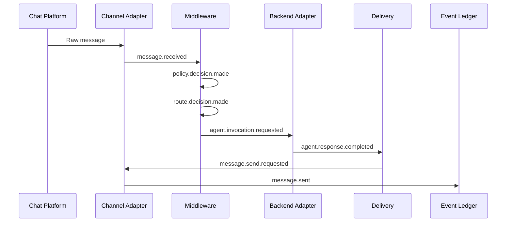
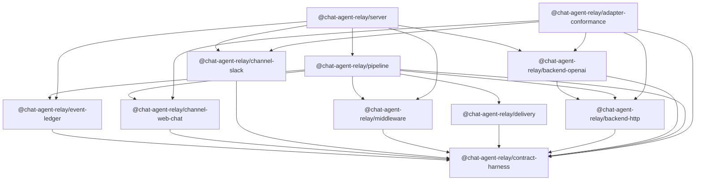
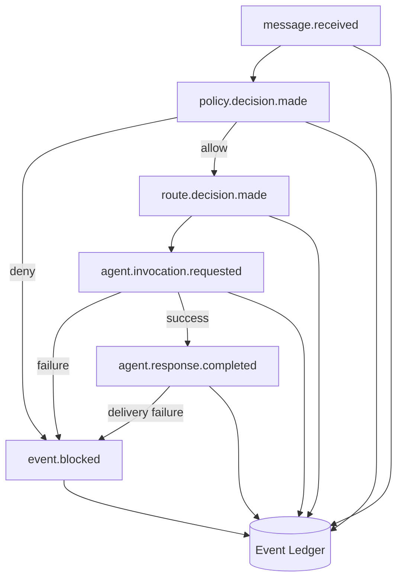
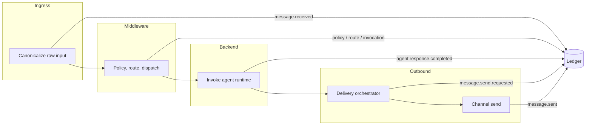

# Chat Agent Relay architecture overview

This document summarizes how Chat Agent Relay (CAR) sits between chat platforms and agent runtimes, how canonical events move through the stack, and how the workspace packages depend on each other. For normative contracts and behavior, see [reference-architecture.md](rfcs/architecture/reference-architecture.md), [channel-adapter-interface-spec.md](rfcs/adapters/channel-adapter-interface-spec.md), and [backend-adapter-interface-spec.md](rfcs/adapters/backend-adapter-interface-spec.md).

## System overview

## Canonical event model

CAR defines a small vocabulary of **canonical events**: JSON documents with a shared envelope, specialized payloads per `event_type`, and causal linkage via `correlation_id` and `causation_id`. The **happy path** for one user turn is a fixed seven-event chain:

1. `message.received` — inbound user text (and metadata) after channel canonicalization  
2. `policy.decision.made` — governance outcome (allow or deny)  
3. `route.decision.made` — chosen backend route  
4. `agent.invocation.requested` — frozen boundary for calling an agent runtime  
5. `agent.response.completed` — completed model or backend output  
6. `message.send.requested` — intent to deliver outbound text to the channel  
7. `message.sent` — delivery completed (including provider message id when available)

An eighth type, **`event.blocked`**, records denied policy, failed backend invocation, or exhausted delivery: it carries `block_stage`, `reason`, and `retryable` so operators can distinguish governance blocks from transient failures.

Every event type is validated against JSON Schemas loaded by `@chat-agent-relay/contract-harness`. The frozen fixture corpus in `docs/schemas/fixtures/` is the machine-readable baseline for implementations.

Raw platform payloads enter through a **channel adapter**, which validates and canonicalizes them into `message.received`. **Middleware** consumes that event and emits policy, route, and invocation events without talking to the chat network or the agent directly in those steps. The **backend adapter** turns `agent.invocation.requested` into a real call to the **agent runtime** (HTTP API, OpenAI, or other). The **event ledger** is the durable append-only record of every canonical event in order, enabling replay, audit, and multi-turn context reconstruction.

## Event chain (happy path)

The following sequence is the logical order of handoffs. In the reference implementation (`@chat-agent-relay/pipeline`), the pipeline also appends each produced event to the ledger as stages complete.

## Trust boundaries

Three coarse zones limit how much each part of the system must trust the others:

- **Chat platform boundary** — Untrusted or semi-trusted vendor payloads. Channel adapters are responsible for validation, deduplication hints, and mapping into CAR’s envelope. Downstream code should assume nothing about wire format beyond validated canonical events.
- **CAR core** — Middleware and delivery orchestration operate on canonical events only. Policy and routing see the same shaped facts the ledger stores, which keeps governance and audit aligned.
- **Agent runtime boundary** — Backend adapters isolate protocol details (HTTP shapes, streaming, API keys) from middleware. Failures are translated into structured backend errors and, when appropriate, into `event.blocked` rather than leaking raw stack traces into the ledger.

The ledger sits at the center of accountability: once appended, events are the source of truth for “what happened” on a turn, independent of which adapter produced them.

## Package dependency graph

The repository ships **eleven** workspace packages. Arrows follow `dependencies` in each `package.json` (production dependencies only). `@chat-agent-relay/contract-harness` is the shared contract root (JSON Schema + Ajv validation). Nothing in `packages/` depends on `@chat-agent-relay/server`; the server is the runnable composition layer.

| Package | Role |
|---------|------|
| `@chat-agent-relay/contract-harness` | Schema load and event validation |
| `@chat-agent-relay/event-ledger` | Append-only store (in-memory, SQLite) |
| `@chat-agent-relay/channel-web-chat` | Web chat ingress canonicalization |
| `@chat-agent-relay/channel-slack` | Slack ingress, send, streaming updates |
| `@chat-agent-relay/middleware` | Policy, routing, invocation event emission |
| `@chat-agent-relay/backend-http` | Generic HTTP backend invocation |
| `@chat-agent-relay/backend-openai` | OpenAI Chat Completions + streaming |
| `@chat-agent-relay/delivery` | Outbound orchestration, retry, DLQ behavior |
| `@chat-agent-relay/pipeline` | End-to-end orchestration and ledger appends |
| `@chat-agent-relay/server` | CLI / HTTP API runtime wiring Slack + OpenAI + SQLite |
| `@chat-agent-relay/adapter-conformance` | Shared tests for channel and backend adapters |

`@chat-agent-relay/pipeline` additionally lists `@chat-agent-relay/channel-slack` and `@chat-agent-relay/backend-openai` under **devDependencies** for integration tests; those edges are omitted from the graph above.

## Adapter contracts

**Channel adapters** implement ingress (and often outbound send) behind a small interface: accept provider-native input, return a schema-valid `message.received` or a structured error; for delivery, execute sends and return a provider message identifier when available. They MUST NOT silently drop failures where the contract calls for `error.occurred` or downstream handling; see the channel adapter RFCs for full rules.

**Backend adapters** accept an **invocation context** derived from `message.received`, policy, route, and `agent.invocation.requested`. They MUST produce a schema-valid `agent.response.completed` on success or a structured failure (including retry hints) on error. This keeps middleware and delivery free of vendor-specific SDK details.

Both adapter families are covered by `@chat-agent-relay/adapter-conformance`, which reuses `@chat-agent-relay/contract-harness` validators to enforce the same schemas production code uses.

## Error path (`event.blocked`)

When policy denies, the backend returns an error, or delivery exhausts retries, the pipeline stops the happy chain and appends **`event.blocked`**. The payload records **`block_stage`** (`governance`, `backend_invocation`, or `delivery` in the reference implementation) so replay and APIs can explain whether the turn failed before routing, during agent execution, or while sending the reply.

## Data flow through pipeline stages and the ledger

Conceptually, each stage consumes canonical facts and emits the next ones; the ledger captures every append in order for the same `correlation_id` / conversation. The diagram below matches how `@chat-agent-relay/pipeline` sequences work: ingress and middleware events are appended before the backend runs; `agent.response.completed` is appended after a successful invocation; delivery emits `message.send.requested`, performs the channel send, then records `message.sent`.

## How to extend

**New chat platforms** — Add a package (or module) that implements the channel ingress contract: map vendor webhooks or socket payloads to `message.received`, preserve correlation and conversation identifiers, and wire a `sendFn` (or equivalent) so delivery can post replies. Run the adapter against `@chat-agent-relay/adapter-conformance` channel fixtures before relying on it in production.

**New agent runtimes** — Implement `BackendAdapter`: map `agent.invocation.requested` and conversation history into your runtime’s API, then map success and failure outcomes to `agent.response.completed` or structured errors. Conformance tests cover both HTTP and OpenAI-style adapters today; new backends can follow the same pattern with additional fixtures if needed.

**Middleware policy and routing** — Replace or configure `PolicyFn` and routing rules inside `@chat-agent-relay/middleware` without changing channel or backend packages, as long as emitted events remain schema-valid and causally linked.

RFCs and ADRs in `docs/rfcs/` and `docs/decisions/` remain authoritative when this overview and the code disagree; prefer updating the RFCs first when changing normative behavior.
