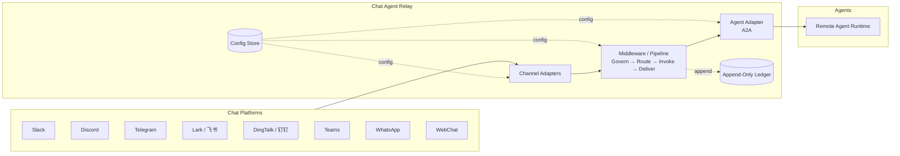
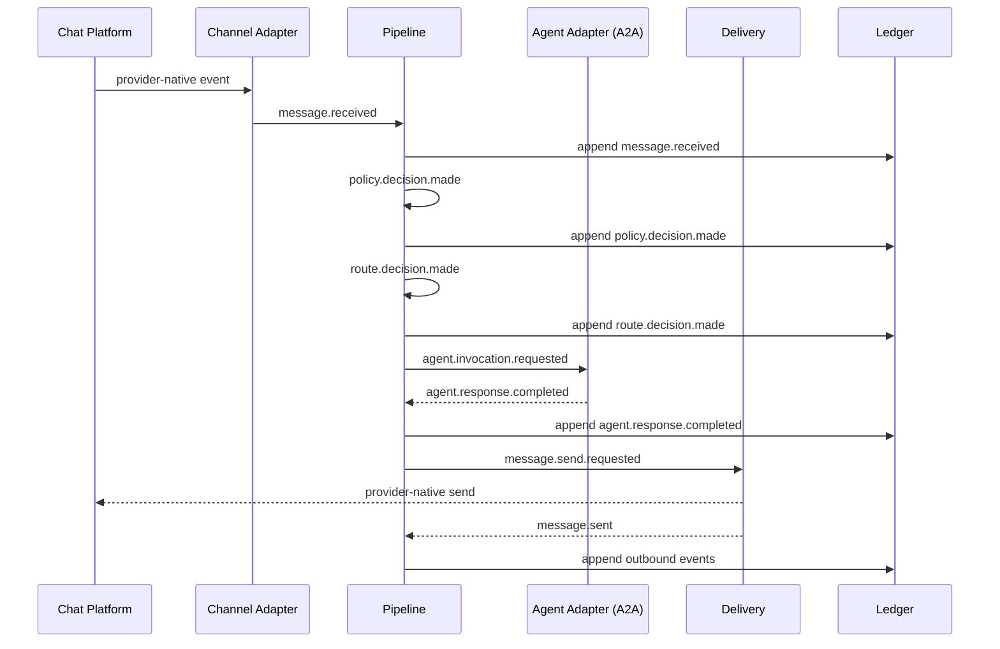
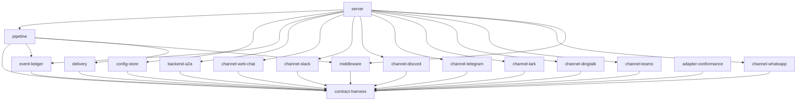
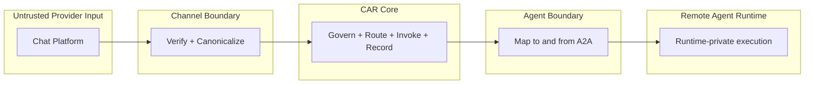

# Chat Agent Relay — Architecture Overview

> Last updated: 2026-04-02

Chat Agent Relay (CAR) is a **standard relay layer between chat platforms and agents**.

This document is an implementation-oriented architecture overview. It explains how the current repository is structured and how the major packages fit together. For normative boundaries and conformance requirements, see the RFCs in `docs/rfcs/`.

---

## 1. Architecture Summary

CAR is centered on a canonical message path:

```text
chat platform ingress
  → channel adapter verification and canonicalization
  → canonical event enters middleware
  → governance
  → route decision
  → agent invocation via A2A
  → canonical outbound intent
  → delivery
  → append-only ledger / replay / audit
```

A compact view of the system:

```text
Chat Platforms → Channel Adapters → Middleware / Pipeline → Agent Adapter (A2A) → Delivery
                                      ↓
                              Append-Only Ledger
                                      ↓
                             Replay / Audit / Query
```

## 2. System Overview


```mermaid
flowchart LR
  subgraph Channels["Chat Platforms"]
    S[Slack]
    D[Discord]
    T[Telegram]
    L[Lark / 飞书]
    DT[DingTalk / 钉钉]
    TM[Teams]
    WA[WhatsApp]
    WC[WebChat]
  end

  subgraph CAR["Chat Agent Relay"]
    CA["Channel Adapters"]
    MW["Middleware / Pipeline\nGovern → Route → Invoke → Deliver"]
    AA["Agent Adapter\nA2A"]
    EL[("Append-Only Ledger")]
    CFG[("Config Store")]
  end

  subgraph Agents["Agents"]
    AG["Remote Agent Runtime"]
  end

  Channels --> CA
  CA --> MW
  MW --> AA
  AA --> AG
  MW -. append .-> EL
  CFG -. config .-> CA
  CFG -. config .-> MW
  CFG -. config .-> AA
```

## 3. Boundary Model

CAR has two adapter boundaries around a canonical core.

### 3.1 Channel-side boundary

Channel adapters sit at the chat-platform boundary. Their responsibility is to:
- receive provider-native traffic
- verify source authenticity where applicable
- canonicalize inbound payloads into `message.received`
- create senders for outbound delivery back to the provider

They are not responsible for:
- route decisions
- message-path governance policy decisions
- agent invocation semantics
- canonical audit or replay truth

### 3.2 Canonical core

Inside CAR, middleware and pipeline logic operate on canonical events rather than provider-native payloads.

Core responsibilities here include:
- governance on the message path
- route selection
- agent invocation orchestration
- delivery orchestration
- append-only recording for replay and audit

### 3.3 Agent-side boundary

On the agent side, CAR uses **A2A** as the standard protocol boundary.

The agent-side adapter is responsible for:
- accepting canonical invocation context
- mapping that context into A2A requests
- mapping A2A results back into canonical CAR semantics
- preserving runtime-specific session handles without redefining CAR's canonical identity

The remote agent runtime remains responsible for its own internal execution model, memory, tools, and private state.

## 4. Canonical Message Path

The repository is built around the same relay path described in the RFCs:

```text
message.received
  → policy.decision.made
  → route.decision.made
  → agent.invocation.requested
  → agent.response.completed
  → message.send.requested
  → message.sent
```

When a path is denied, blocked, or fails terminally, CAR records `event.blocked` rather than silently dropping the outcome.

This gives the system a stable internal contract for:
- replay
- audit
- explanation of blocked or failed outcomes
- consistent behavior across channels and agents

## 5. Adapter Interfaces

### 5.1 ChannelAdapter

Channel integrations are built around the `ChannelAdapter` interface:

```typescript
interface ChannelAdapter {
  readonly channelType: string;
  describeCapabilities(): ChannelCapabilities;
  canonicalize(raw: unknown): CanonicalizationResult;
  createSender(event: CanonicalEvent): ChannelSender;
}
```

This interface unifies inbound canonicalization and outbound sender creation in one boundary.

### 5.2 AgentAdapter

Agent integrations are built around the `AgentAdapter` interface:

```typescript
interface AgentAdapter {
  describeCapabilities(): AgentCapabilities;
  invoke(context: AgentInvocationContext): Promise<AgentResult>;
  stream?(context: AgentInvocationContext): AsyncGenerator<AgentEvent, AgentResult>;
  resume?(sessionHandle: string, input: AgentResumeInput): Promise<AgentResult>;
  resumeStream?(sessionHandle: string, input: AgentResumeInput): AsyncGenerator<AgentEvent, AgentResult>;
  cancel?(sessionHandle: string): Promise<void>;
}
```

The built-in implementation is A2A-centered.

## 6. Pipeline Flow

The pipeline orchestrates one canonical relay path from inbound message to outbound delivery.


```mermaid
sequenceDiagram
  participant CP as Chat Platform
  participant CH as Channel Adapter
  participant PL as Pipeline
  participant AG as Agent Adapter (A2A)
  participant DL as Delivery
  participant LG as Ledger

  CP->>CH: provider-native event
  CH->>PL: message.received
  PL->>LG: append message.received
  PL->>PL: policy.decision.made
  PL->>LG: append policy.decision.made
  PL->>PL: route.decision.made
  PL->>LG: append route.decision.made
  PL->>AG: agent.invocation.requested
  AG-->>PL: agent.response.completed
  PL->>LG: append agent.response.completed
  PL->>DL: message.send.requested
  DL-->>CP: provider-native send
  DL-->>PL: message.sent
  PL->>LG: append outbound events
```

At a high level:
- channel adapters translate at the edge
- middleware and pipeline enforce the relay path
- the agent adapter bridges to A2A
- delivery translates canonical outbound intent into provider-native actions
- the ledger records the durable explanation trail

## 7. Replay and Audit

The append-only ledger is the durable explanation center for the message path.

It exists to preserve:
- the canonical path for a conversation or correlation scope
- why a message was allowed or denied
- which route was chosen
- whether invocation and delivery succeeded or failed

The ledger is CAR's source of truth for replay and audit. Provider-native payloads and runtime-private state are not.

## 8. Runtime Structure in This Repository

The repository packages are organized around the relay path.


```mermaid
graph TD
  CH["contract-harness"]

  EL["event-ledger"] --> CH
  MW["middleware"] --> CH
  DEL["delivery"] --> CH
  A2A["backend-a2a"] --> CH
  WC["channel-web-chat"] --> CH
  SL["channel-slack"] --> CH
  DC["channel-discord"] --> CH
  TG["channel-telegram"] --> CH
  LK["channel-lark"] --> CH
  DD["channel-dingtalk"] --> CH
  TM["channel-teams"] --> CH
  WA["channel-whatsapp"] --> CH
  CFG["config-store"] --> CH

  PL["pipeline"] --> CH
  PL --> EL
  PL --> MW
  PL --> DEL

  SRV["server"] --> PL
  SRV --> CFG
  SRV --> EL
  SRV --> A2A
  SRV --> WC
  SRV --> SL
  SRV --> DC
  SRV --> TG
  SRV --> LK
  SRV --> DD
  SRV --> TM
  SRV --> WA
  SRV --> MW

  CONF["adapter-conformance"] --> CH
```

### Package roles

| Package | Purpose |
|---|---|
| `contract-harness` | Canonical types, schemas, validation, lifecycle helpers, shared adapter contracts |
| `event-ledger` | Append-only event storage and query support |
| `middleware` | Governance, routing, and related message-path logic |
| `delivery` | Delivery orchestration and retry behavior |
| `pipeline` | End-to-end canonical path orchestration |
| `config-store` | Persistent configuration for channels, agents, routes, and settings |
| `backend-a2a` | Built-in A2A agent adapter |
| `channel-*` packages | Built-in channel adapters for supported chat platforms |
| `server` | CLI entry point, HTTP API, and runtime wiring |
| `adapter-conformance` | Conformance testing helpers for channel and agent adapters |

## 9. Configuration Model

CAR stores runtime configuration separately from the canonical event ledger.

At a high level:
- channels are registered in config storage
- agents are registered in config storage
- route rules determine which registered agent receives a turn
- the server loads configuration and wires registries from that state

The default built-in configuration store is SQLite-backed.

## 10. Extension Points

The main extension points in the current repository are:
- new `ChannelAdapter` implementations
- new `AgentAdapter` implementations that preserve the A2A-centered boundary
- route rules and middleware configuration
- alternative implementations of storage interfaces where supported

Conformance helpers exist so custom adapters can be validated against the shared contracts.

## 11. Security and Trust Boundaries


```mermaid
flowchart LR
  subgraph A["Untrusted Provider Input"]
    CP["Chat Platform"]
  end

  subgraph B["Channel Boundary"]
    CH["Verify + Canonicalize"]
  end

  subgraph C["CAR Core"]
    CORE["Govern + Route + Invoke + Record"]
  end

  subgraph D["Agent Boundary"]
    AG["Map to and from A2A"]
  end

  subgraph E["Remote Agent Runtime"]
    RT["Runtime-private execution"]
  end

  CP --> CH --> CORE --> AG --> RT
```

Key trust-boundary rules:
- provider-native input is untrusted until verified and canonicalized
- CAR core operates on canonical events, not raw provider payloads
- provider-native detail remains in optional structured extensions
- runtime-private state remains on the agent side of the A2A boundary
- replay and audit truth remains in CAR's ledger

## 12. Notes on Current Implementation

The current repository includes:
- built-in adapters for major chat platforms
- a built-in A2A adapter for agent invocation
- delivery retry behavior
- multi-turn relay context
- streaming and resumable interaction support where capabilities allow it
- conformance tooling for adapters

This overview is intentionally descriptive of the current repository structure. If this document and the RFCs ever diverge, the RFCs in `docs/rfcs/` are authoritative.
