# Chat Agent Relay — Architecture

> Last updated: 2026-04-01 · Version: v3.0

Chat Agent Relay (CAR) is a middleware framework that sits between chat platforms and AI agent runtimes. It canonicalizes every interaction into an immutable event chain, enforces governance, routes to the right agent, and delivers the response — with full auditability.

For normative contracts, see the companion RFCs in `docs/rfcs/`.

---

## 1. System Overview

```
                        ┌──────────────────────────────────────────────────────┐
                        │                 Chat Agent Relay                      │
                        │                                                      │
  Slack  ───┐           │  ┌──────────┐  ┌────────────┐  ┌──────────────────┐ │           ┌── A2A Agent
  Discord ──┤  inbound  │  │ Channel  │  │  Pipeline   │  │  Agent           │ │  outbound │   (CrewAI, ADK,
  Telegram ─┤ ────────► │  │ Registry │─►│  (7-event   │─►│  Registry        │ │ ────────► │    AutoGen,
  Lark ─────┤           │  │          │  │   chain)    │  │                  │ │           │    LangGraph,
  DingTalk ─┤           │  └──────────┘  └──────┬─────┘  └──────────────────┘ │           │    Mastra, ...)
  Teams ────┤           │                       │                              │
  WhatsApp ─┤           │                       │                              │
  WebChat ──┘           │                       │                              │
                        │               ┌───────▼───────┐  ┌──────────────┐   │
                        │               │ Event Ledger  │  │ Config Store │   │
                        │               │ (append-only) │  │  (SQLite)    │   │
                        │               └───────────────┘  └──────────────┘   │
                        └──────────────────────────────────────────────────────┘
```

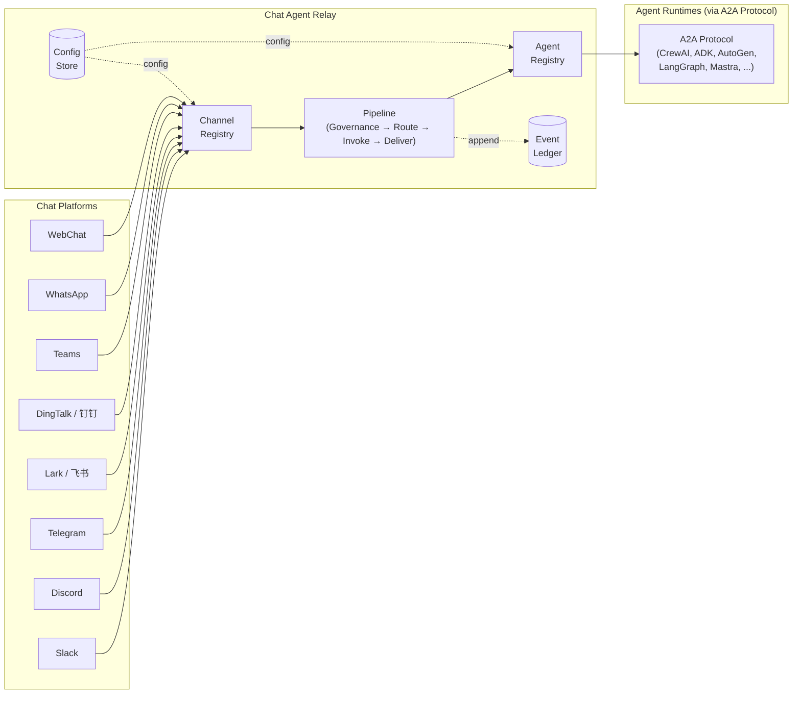
```mermaid
flowchart LR
  subgraph Channels["Chat Platforms"]
    S[Slack]
    D[Discord]
    T[Telegram]
    L[Lark / 飞书]
    DT[DingTalk / 钉钉]
    TM[Teams]
    WA[WhatsApp]
    W[WebChat]
  end

  subgraph CAR["Chat Agent Relay"]
    CR["Channel\nRegistry"]
    PP["Pipeline\n(Governance → Route → Invoke → Deliver)"]
    AR["Agent\nRegistry"]
    EL[("Event\nLedger")]
    CS[("Config\nStore")]
  end

  subgraph Agents["Agent Runtimes (via A2A Protocol)"]
    A2A["A2A Protocol\n(CrewAI, ADK, AutoGen,\nLangGraph, Mastra, ...)"]
  end

  S & D & T & L & DT & TM & WA & W --> CR
  CR --> PP
  PP --> AR
  AR --> A2A
  PP -.->|append| EL
  CS -.->|config| CR & AR
```

---

## 2. Core Abstractions

CAR defines two adapter boundaries and a central canonical event model. Everything inside the framework operates on canonical events only.

### 2.1 ChannelAdapter — Chat Platform Boundary

Every chat platform is wrapped by a `ChannelAdapter` that unifies ingress, egress, and capability declaration in a single boundary:

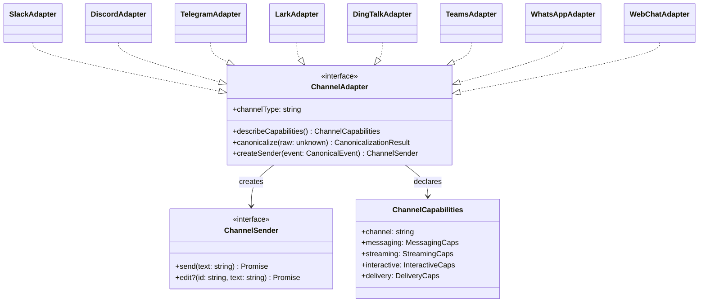
```mermaid
classDiagram
  class ChannelAdapter {
    <<interface>>
    +channelType: string
    +describeCapabilities() ChannelCapabilities
    +canonicalize(raw: unknown) CanonicalizationResult
    +createSender(event: CanonicalEvent) ChannelSender
  }

  class ChannelSender {
    <<interface>>
    +send(text: string) Promise
    +edit?(id: string, text: string) Promise
  }

  class ChannelCapabilities {
    +channel: string
    +messaging: MessagingCaps
    +streaming: StreamingCaps
    +interactive: InteractiveCaps
    +delivery: DeliveryCaps
  }

  ChannelAdapter --> ChannelSender : creates
  ChannelAdapter --> ChannelCapabilities : declares

  SlackAdapter ..|> ChannelAdapter
  DiscordAdapter ..|> ChannelAdapter
  TelegramAdapter ..|> ChannelAdapter
  LarkAdapter ..|> ChannelAdapter
  DingTalkAdapter ..|> ChannelAdapter
  TeamsAdapter ..|> ChannelAdapter
  WhatsAppAdapter ..|> ChannelAdapter
  WebChatAdapter ..|> ChannelAdapter
```

**Design principle**: The adapter derives delivery targets from `provider_extensions` on the canonical event, not from external parameters. This eliminates `instanceof` checks and per-channel dispatch logic in the pipeline.

### 2.2 AgentAdapter — Agent Runtime Boundary

Every agent runtime is wrapped by an `AgentAdapter` aligned with the A2A protocol model:

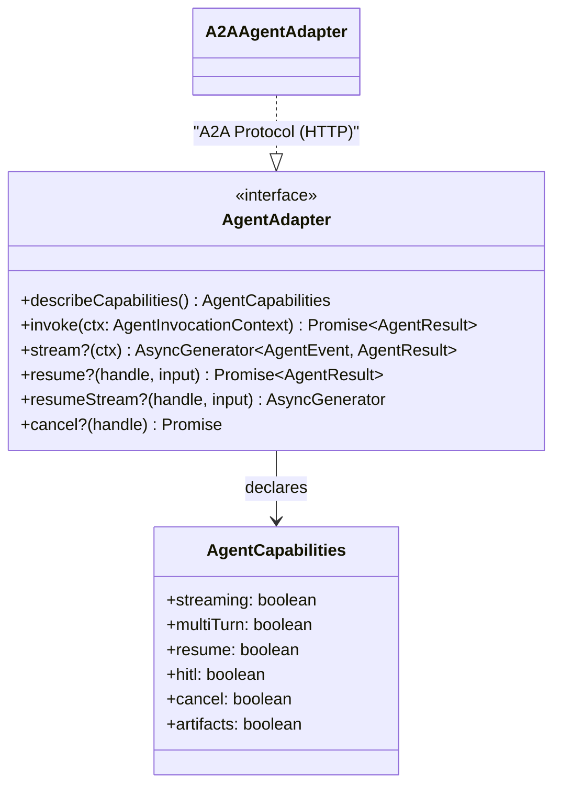
```mermaid
classDiagram
  class AgentAdapter {
    <<interface>>
    +describeCapabilities() AgentCapabilities
    +invoke(ctx: AgentInvocationContext) Promise~AgentResult~
    +stream?(ctx) AsyncGenerator~AgentEvent, AgentResult~
    +resume?(handle, input) Promise~AgentResult~
    +resumeStream?(handle, input) AsyncGenerator
    +cancel?(handle) Promise
  }

  class AgentCapabilities {
    +streaming: boolean
    +multiTurn: boolean
    +resume: boolean
    +hitl: boolean
    +cancel: boolean
    +artifacts: boolean
  }

  AgentAdapter --> AgentCapabilities : declares

  A2AAgentAdapter ..|> AgentAdapter : "A2A Protocol (HTTP)"
```

**Capability-driven pipeline**: The pipeline uses `AgentCapabilities` to decide behavior:
- `multiTurn` → include conversation history from ledger
- `streaming` → use `stream()` when channel supports progressive update
- `resume` → enable HITL continuation after `input_required`

### 2.3 Canonical Event Model

All canonical events share a common envelope. The happy path for one user turn is a fixed seven-event chain:

```
message.received           → user's message, canonicalized from any platform
  policy.decision.made     → governance outcome (allow / deny)
  route.decision.made      → which agent handles this
  agent.invocation.requested → dispatch to agent runtime
  agent.response.completed → agent's reply captured
  message.send.requested   → queued for delivery
  message.sent             → delivered to user's chat platform
```

Every event carries `correlation_id` (links all events in a request) and `causation_id` (parent → child).

---

## 3. Pipeline — Event Chain Orchestration

The `FirstExecutablePathPipeline` is the core orchestrator. It processes one user turn end-to-end, appending each event to the ledger as it progresses.

**Inbound path**: Before route and inbound policy, the pipeline applies **access control** (sender allowlist/blocklist) and **rate limiting** (sliding window; scope configurable per sender, conversation, or tenant). Failures short-circuit to `event.blocked` like other governance denies.

**Outbound path**: After `agent.response.completed` and before delivery, an **outbound governance** step runs a **pre-send policy** on the agent’s text so unsafe or policy-violating replies are blocked before they reach the channel.

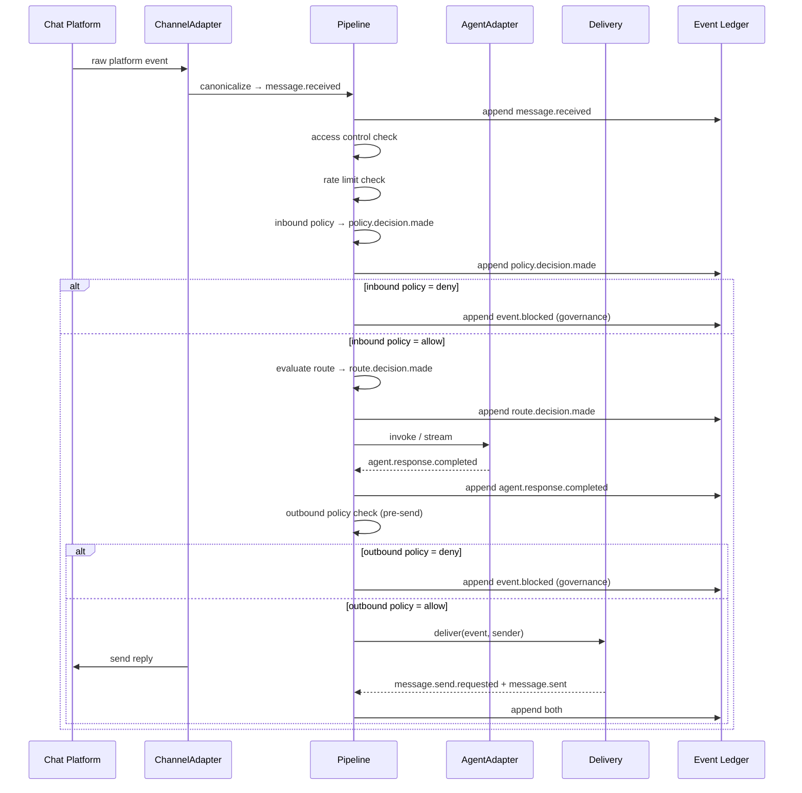
```mermaid
sequenceDiagram
  participant User as Chat Platform
  participant CA as ChannelAdapter
  participant PL as Pipeline
  participant Agent as AgentAdapter
  participant DL as Delivery
  participant Ledger as Event Ledger

  User->>CA: raw platform event
  CA->>PL: canonicalize → message.received
  PL->>Ledger: append message.received
  PL->>PL: access control check
  PL->>PL: rate limit check
  PL->>PL: inbound policy → policy.decision.made
  PL->>Ledger: append policy.decision.made

  alt inbound policy = deny
    PL->>Ledger: append event.blocked (governance)
  else inbound policy = allow
    PL->>PL: evaluate route → route.decision.made
    PL->>Ledger: append route.decision.made
    PL->>Agent: invoke / stream
    Agent-->>PL: agent.response.completed
    PL->>Ledger: append agent.response.completed
    PL->>PL: outbound policy check (pre-send)
    alt outbound policy = deny
      PL->>Ledger: append event.blocked (governance)
    else outbound policy = allow
      PL->>DL: deliver(event, sender)
      CA->>User: send reply
      DL-->>PL: message.send.requested + message.sent
      PL->>Ledger: append both
    end
  end
```

### HITL (human-in-the-loop)

When the agent signals input-required (A2A), the pipeline does not treat the turn as finished with a normal assistant message:

```
Agent returns input-required → Pipeline stores pending session → User reply → Pipeline resumes agent
```

The pending session ties the user’s follow-up to `resume` / `resumeStream` on the same agent adapter so HITL is a transparent relay of the A2A input-required state.

### Error Path (`event.blocked`)

When policy denies, the agent fails, or delivery exhausts retries, the pipeline emits `event.blocked` with `block_stage`, `reason`, and `retryable`:

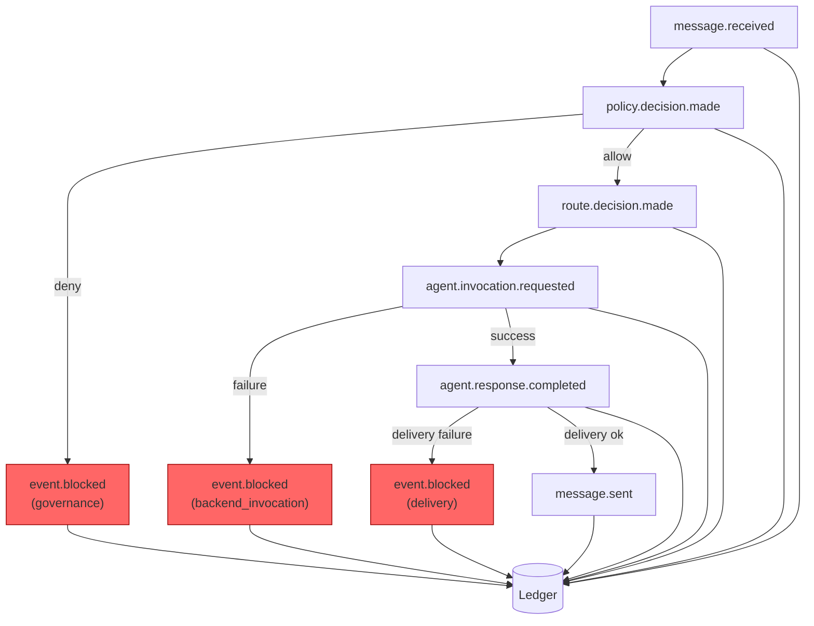
```mermaid
flowchart TD
  MR["message.received"] --> PD["policy.decision.made"]
  PD -->|deny| EB1["event.blocked\n(governance)"]
  PD -->|allow| RD["route.decision.made"]
  RD --> AI["agent.invocation.requested"]
  AI -->|failure| EB2["event.blocked\n(backend_invocation)"]
  AI -->|success| AR["agent.response.completed"]
  AR -->|delivery failure| EB3["event.blocked\n(delivery)"]
  AR -->|delivery ok| MS["message.sent"]

  MR & PD & RD & AI & AR & MS --> L[("Ledger")]
  EB1 & EB2 & EB3 --> L

  style EB1 fill:#f66,stroke:#900
  style EB2 fill:#f66,stroke:#900
  style EB3 fill:#f66,stroke:#900
```

---

## 4. Runtime Architecture

### 4.1 Factory Registration Pattern

Registries use a factory pattern for zero-coupling to specific adapter implementations:

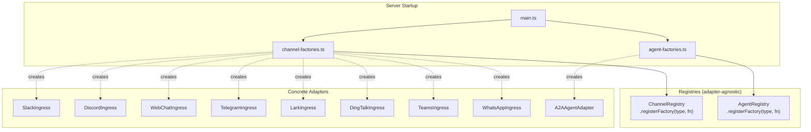
```mermaid
flowchart TD
  subgraph Startup["Server Startup"]
    M["main.ts"]
    CF["channel-factories.ts"]
    AF["agent-factories.ts"]
  end

  subgraph Registry["Registries (adapter-agnostic)"]
    CR["ChannelRegistry\n.registerFactory(type, fn)"]
    AR["AgentRegistry\n.registerFactory(type, fn)"]
  end

  subgraph Adapters["Concrete Adapters"]
    SA["SlackIngress"]
    DA["DiscordIngress"]
    WCI["WebChatIngress"]
    TA["TelegramIngress"]
    LA["LarkIngress"]
    DTA["DingTalkIngress"]
    TMI["TeamsIngress"]
    WMI["WhatsAppIngress"]
    A2A["A2AAgentAdapter"]
  end

  M --> CF --> CR
  M --> AF --> AR
  CF -.->|creates| SA & DA & WCI & TA & LA & DTA & TMI & WMI
  AF -.->|creates| A2A
```

**Key property**: `ChannelRegistry` and `AgentRegistry` contain zero imports of specific adapters. All adapter knowledge lives in the factory files. Third parties register custom types via `registry.registerFactory("custom", myFactory)`.

### 4.2 Lifecycle Management

Long-lived adapter connections (WebSocket) implement lifecycle interfaces from `contract-harness`:

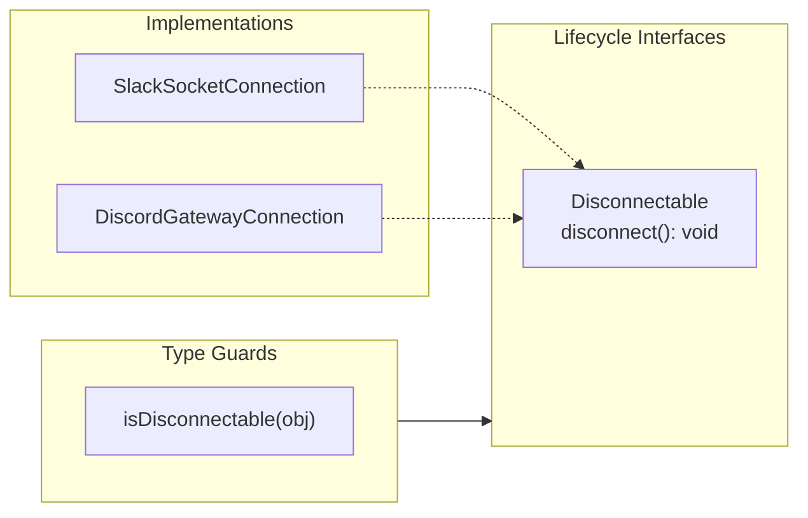
```mermaid
flowchart LR
  subgraph Interfaces["Lifecycle Interfaces"]
    D["Disconnectable\ndisconnect(): void"]
  end

  subgraph Implementations
    SSC["SlackSocketConnection"] -.-> D
    DGC["DiscordGatewayConnection"] -.-> D
  end

  subgraph Guards["Type Guards"]
    ID["isDisconnectable(obj)"]
  end

  Guards --> Interfaces
```

Registries use type guards (not `instanceof`) for cleanup during `unregister()`.

### 4.3 Streaming Models

CAR supports two streaming approaches, determined by `ChannelCapabilities`:

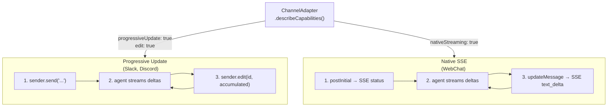
```mermaid
flowchart TD
  subgraph Progressive["Progressive Update\n(Slack, Discord)"]
    P1["1. sender.send('...')"] --> P2["2. agent streams deltas"]
    P2 --> P3["3. sender.edit(id, accumulated)"]
    P3 --> P2
  end

  subgraph Native["Native SSE\n(WebChat)"]
    N1["1. postInitial → SSE status"] --> N2["2. agent streams deltas"]
    N2 --> N3["3. updateMessage → SSE text_delta"]
    N3 --> N2
  end

  CA["ChannelAdapter\n.describeCapabilities()"]
  CA -->|"progressiveUpdate: true\nedit: true"| Progressive
  CA -->|"nativeStreaming: true"| Native
```

---

## 5. Delivery

The `DeliveryOrchestrator` accepts a `ChannelSender` (not a bare function) and handles retry with exponential backoff:

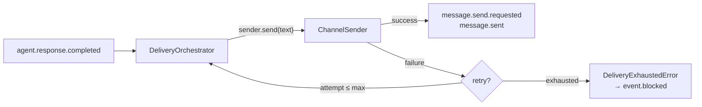
```mermaid
flowchart LR
  ARC["agent.response.completed"] --> DO["DeliveryOrchestrator"]
  DO -->|"sender.send(text)"| CS["ChannelSender"]
  CS -->|success| MSR["message.send.requested\nmessage.sent"]
  CS -->|failure| RT{retry?}
  RT -->|"attempt ≤ max"| DO
  RT -->|exhausted| DEE["DeliveryExhaustedError\n→ event.blocked"]
```

---

## 6. Trust Boundaries

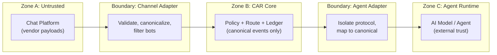
```mermaid
flowchart LR
  subgraph Untrusted["Zone A: Untrusted"]
    CP["Chat Platform\n(vendor payloads)"]
  end

  subgraph Boundary1["Boundary: Channel Adapter"]
    CA["Validate, canonicalize,\nfilter bots"]
  end

  subgraph Trusted["Zone B: CAR Core"]
    MW["Policy + Route + Ledger\n(canonical events only)"]
  end

  subgraph Boundary2["Boundary: Agent Adapter"]
    BA["Isolate protocol,\nmap to canonical"]
  end

  subgraph External["Zone C: Agent Runtime"]
    AR["AI Model / Agent\n(external trust)"]
  end

  CP --> CA --> MW --> BA --> AR
```

- **Zone A → B**: Channel adapters validate signatures, reject bot messages, canonicalize raw payloads. No raw vendor data crosses inward.
- **Zone B**: All governance, routing, and recording operate on canonical events. Provider details stay in `provider_extensions`.
- **Zone B → C**: Agent adapters isolate protocol details. Failures become structured errors, not raw stack traces.
- **Event Ledger**: Sits at the center of accountability — the source of truth for what happened.

---

## 7. Package Dependency Graph

The repository ships **17** workspace packages under `packages/`. Arrows follow production `dependencies`.

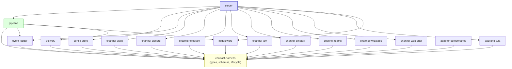
```mermaid
graph TD
  CH["contract-harness\n(types, schemas, lifecycle)"]

  EL["event-ledger"] --> CH
  MW["middleware"] --> CH
  DEL["delivery"] --> CH
  BA2A["backend-a2a"] --> CH
  CWC["channel-web-chat"] --> CH
  CS["channel-slack"] --> CH
  CD["channel-discord"] --> CH
  CT["channel-telegram"] --> CH
  CL["channel-lark"] --> CH
  CDT["channel-dingtalk"] --> CH
  CTM["channel-teams"] --> CH
  CWA["channel-whatsapp"] --> CH
  CFG["config-store"] --> CH

  PL["pipeline"] --> CH & EL & MW & DEL

  SR["server"] --> PL & CFG & EL & CS & CD & CT & CL & CDT & CTM & CWA & CWC & BA2A & MW

  AC["adapter-conformance"] --> CH

  style CH fill:#ffd,stroke:#aa0
  style SR fill:#ddf,stroke:#00a
  style PL fill:#dfd,stroke:#0a0
```

| Package | Purpose |
|---------|---------|
| `contract-harness` | Schema validation, canonical types, lifecycle interfaces (`Disconnectable`), channel/agent type definitions |
| `event-ledger` | Append-only store (`LedgerStore` interface), in-memory and SQLite implementations |
| `middleware` | Inbound/outbound policy, access control, rate limiting, routing |
| `delivery` | Outbound orchestration with `ChannelSender`, retry + exponential backoff |
| `pipeline` | End-to-end 7-event chain orchestration, capability-driven streaming, multi-turn context |
| `config-store` | SQLite-backed `ConfigStore` for channels, agents, routes, settings; AES-256-GCM credential encryption |
| `channel-slack` | Slack Socket Mode ingress + `chat.postMessage` / `chat.update` sender |
| `channel-discord` | Discord Gateway ingress + REST API sender |
| `channel-telegram` | Telegram Bot API webhook ingress + sender |
| `channel-lark` | Lark/飞书 Event Subscription ingress + sender |
| `channel-dingtalk` | DingTalk/钉钉 callback ingress + webhook sender |
| `channel-teams` | Microsoft Teams Bot Framework ingress + sender |
| `channel-whatsapp` | WhatsApp Cloud API webhook ingress + sender |
| `channel-web-chat` | HTTP ingress + SSE streaming |
| `backend-a2a` | A2A protocol adapter (streaming, HITL, artifacts, cancel) — covers CrewAI, Google ADK, AutoGen, LangGraph, Mastra, and all A2A-compliant agents |
| `server` | CLI entry point, HTTP API, factory wiring, graceful shutdown |
| `adapter-conformance` | Reusable conformance tests for channel and agent adapters |

---

## 8. Configuration and Management

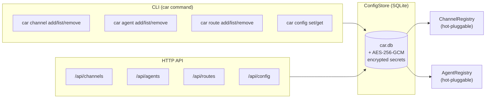
```mermaid
flowchart LR
  subgraph CLI["CLI (car command)"]
    CC["car channel add/list/remove"]
    CA["car agent add/list/remove"]
    CRT["car route add/list/remove"]
    CCF["car config set/get"]
  end

  subgraph API["HTTP API"]
    AC["/api/channels"]
    AA["/api/agents"]
    ART["/api/routes"]
    ACF["/api/config"]
  end

  subgraph Store["ConfigStore (SQLite)"]
    DB[("car.db\n+ AES-256-GCM\nencrypted secrets")]
  end

  CLI --> DB
  API --> DB
  DB --> CR["ChannelRegistry\n(hot-pluggable)"] & AR["AgentRegistry\n(hot-pluggable)"]
```

Channels and agents can be added, updated, enabled, disabled, or removed at runtime without restarting the server.

---

## 9. Adapter Capability Matrix

### Channel Adapters

| Channel | Text | Attachments | Reactions | Threads | Progressive Update | Native Streaming | Edit | Commands |
|---------|------|-------------|-----------|---------|-------------------|-----------------|------|----------|
| Slack | ✓ | ✓ | ✓ | ✓ | ✓ | ✗ | ✓ | ✓ |
| Discord | ✓ | ✓ | ✓ | ✓ | ✓ | ✗ | ✓ | ✓ |
| Telegram | ✓ | ✓ | ✗ | ✓ | ✓ | ✗ | ✓ | ✓ |
| Lark | ✓ | ✗ | ✗ | ✗ | ✓ | ✗ | ✓ | ✗ |
| DingTalk | ✓ | ✗ | ✗ | ✗ | ✗ | ✗ | ✗ | ✗ |
| Teams | ✓ | ✗ | ✗ | ✓ | ✓ | ✗ | ✓ | ✗ |
| WhatsApp | ✓ | ✗ | ✗ | ✗ | ✗ | ✗ | ✗ | ✗ |
| WebChat | ✓ | ✗ | ✗ | ✗ | ✗ | ✓ | ✗ | ✓ |

### Agent Adapters

| Agent | Streaming | Multi-Turn | Resume | HITL | Cancel | Artifacts |
|-------|-----------|-----------|--------|------|--------|-----------|
| A2A | ✓ | ✓ | ✓ | ✓ | ✓ | ✓ |

---

## 10. Extending CAR

### New chat platform

1. Implement `ChannelAdapter` (4 members: `channelType`, `describeCapabilities`, `canonicalize`, `createSender`)
2. Run `testChannelAdapter()` from `adapter-conformance` to validate
3. Create a factory function and register via `registry.registerFactory("mytype", factory)`

### New agent runtime

1. Implement `AgentAdapter` (at minimum `describeCapabilities` + `invoke`; optionally `stream`, `resume`, `cancel`)
2. Run `testAgentAdapter()` from `adapter-conformance` to validate
3. Create a factory function and register via `registry.registerFactory("mytype", factory)`

### Custom middleware

Replace or configure `PolicyFn` and routing rules in `@chat-agent-relay/middleware` without changing adapter packages.

---

## 12. Security

- **API authentication**: HTTP API requests can require a **Bearer** token; when `CAR_API_KEY` is set, clients must send `Authorization: Bearer <key>`.
- **Webhook signature verification**: Untrusted ingress uses the **`WebhookVerifier`** interface in `contract-harness`. Implementations cover **Slack**, **Microsoft Teams**, **Telegram**, **Lark**, **DingTalk**, and **WhatsApp** so platform callbacks are authenticated before canonicalization.
- **Tenant isolation**: When `tenant.isolation` is enabled, **`X-Tenant-ID`** scopes ledger query and replay APIs so tenants cannot read each other’s history.
- **Credential encryption**: Sensitive fields in `ConfigStore` (tokens, API keys) use **AES-256-GCM** when `CAR_ENCRYPTION_KEY` is configured (see section 8).

---

## 13. Governance

- **Inbound policy (pre-route)**: Structured conditions over sender, channel, time window, content length, and boolean composition (`and` / `or` / `not`). Deny rules are mandatory when they match.
- **Outbound policy (pre-send)**: Content filtering on agent responses before delivery; complements inbound rules for the assistant → user direction.
- **Access control**: Sender **allowlist** / **blocklist** evaluated early on the inbound path.
- **Rate limiting**: **Sliding window** limits with configurable **scope** (per sender, conversation, or tenant).
- **HITL**: **Transparent relay** of A2A **input-required** state — pending sessions and `resume` keep the human turn in-band without bespoke channel code.

---

## 11. Known Technical Debt

| Item | Status | Notes |
|------|--------|-------|
| Pipeline creates new instance per request | By design | Ensures statelessness. **`ContractHarnessValidators.getShared()`** supplies a process-wide cached validator so JSON Schema / Ajv work is not duplicated per request. |
| WebChat streaming uses `streamingOverride` | Acceptable | HTTP-response-based channels cannot use `sender.edit()`. Override path is the correct escape hatch. |

---

RFCs in `docs/rfcs/` remain authoritative when this overview and the code disagree; prefer updating the RFCs first when changing normative behavior.
