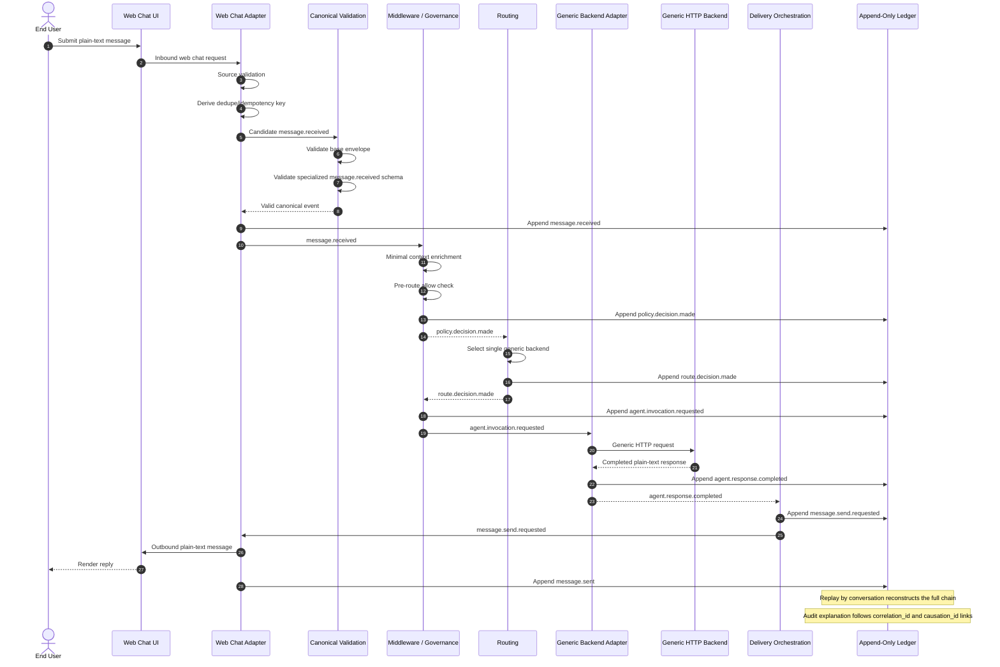

# Chat Agent Relay First Executable Path Sequence Diagram

This document derives a single sequence diagram from `docs/decisions/first-executable-path-plan.md`.

It is a planning/design artifact, not a new normative protocol source and not an approval to start the depicted runtime surfaces.

## Purpose

Freeze the exact interaction order for the first executable CAR happy path:
- one inbound plain-text web chat message
- one allow policy decision
- one route decision
- one generic HTTP backend invocation
- one completed plain-text backend response
- one outbound plain-text web chat send
- one replayable append-only ledger chain

## Participants

- End User
- Web Chat UI
- Web Chat Adapter
- Canonical Validation Boundary
- Middleware / Governance
- Routing
- Generic Backend Adapter
- Generic Backend
- Delivery Orchestration
- Append-Only Ledger

## Sequence Diagram

## Event Order Fixed by This Diagram

1. `message.received`
2. `policy.decision.made`
3. `route.decision.made`
4. `agent.invocation.requested`
5. `agent.response.completed`
6. `message.send.requested`
7. `message.sent`

## Boundary Notes

### Adapter boundary
- translates inbound and outbound web chat traffic
- does not decide policy or routing

### Validation boundary
- validates the envelope first
- validates the event-specific schema second when present
- blocks invalid canonical events from entering the happy path

### Middleware boundary
- enriches minimal context
- emits the allow decision
- records the invocation request

### Routing boundary
- chooses one backend for the slice
- records the route rationale as a canonical fact

### Backend adapter boundary
- invokes the runtime through a generic HTTP contract
- maps runtime output back into canonical response shape

### Delivery boundary
- starts from `agent.response.completed`
- records `message.send.requested` before the outbound send
- records `message.sent` after successful send

### Ledger boundary
- stores all seven canonical facts durably
- remains the source of truth for replay and audit

## Review-Gate Interpretation

This diagram records the intended seven-event runtime shape, but the current repository state remains at the review gate.

What is already proven now:
- the seven-event fixture corpus is frozen
- `packages/contract-harness` can load fixtures, resolve schemas deterministically, validate envelope-first, validate specialized schemas, and assert the chain
- `packages/event-ledger` can only model append, replay, and audit behavior as a bounded in-memory prototype over already-canonical events

What is not approved by this diagram:
- the web chat adapter runtime shown here
- the backend HTTP runtime shown here
- durable ledger persistence
- replay/query APIs
- orchestration services around these boundaries

## Out of Scope in This Diagram

This sequence intentionally excludes:
- deny paths
- duplicate ingress paths
- retries and dead-letter handling
- streaming deltas
- tool events
- handoff
- attachments, rich text, or rich media
- provider delivery callbacks beyond the minimum successful send result
