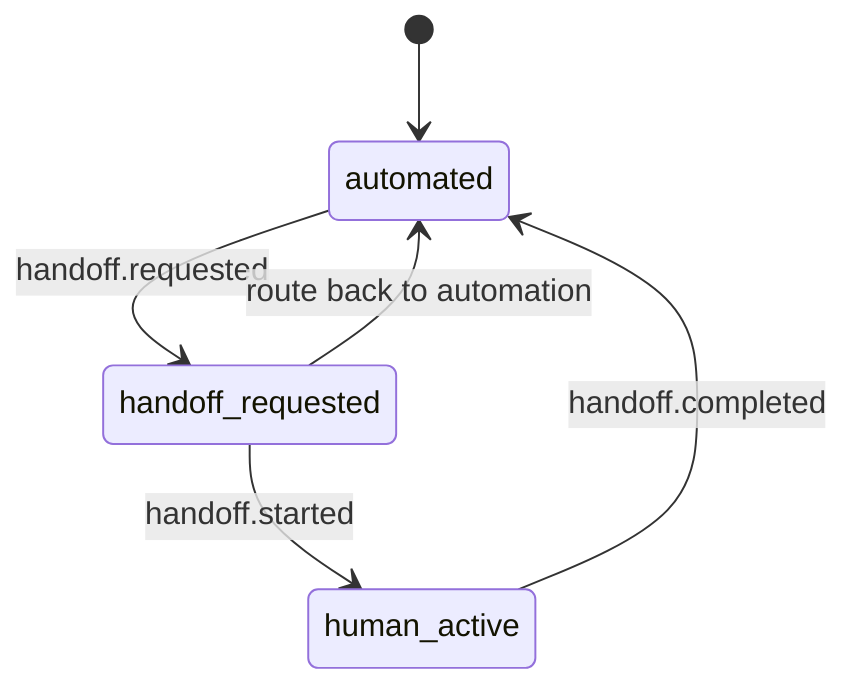

# RFC: CAP Backend Agent Adapter Contract

| | |
|---|---|
| **Status** | Draft |
| **Author** | Claude Code |
| **Audience** | Backend runtime / workflow adapter implementers |
| **Version** | v0.1 |
| **Last Updated** | 2026-03-17 |

## 1. Abstract

This RFC defines the backend-facing contract that allows CAP to integrate multiple agent and workflow runtimes without coupling the middleware core to a single framework.

## 2. Purpose

This RFC defines the stable boundary between middleware and arbitrary Agent / workflow runtimes.

## 3. Normative Language

The key words **MUST**, **MUST NOT**, **SHOULD**, **SHOULD NOT**, and **MAY** are to be interpreted as described in RFC 2119.

## 4. Minimum Kernel Scope

The minimum CAP kernel does not need every possible runtime abstraction. It MUST only support enough to prove the backend boundary is stable:
- create or resume backend session mapping
- handle one canonical invocation event
- emit one completed response or structured error
- propagate trace / correlation

Streaming, tool events, cancellation, and handoff signaling SHOULD be designed in from the start, but MAY arrive in phases.

## 5. Goals

- Support multiple backend runtimes
- Isolate framework-specific objects
- Preserve unified semantics for session / streaming / tool call / error / handoff
- Ensure trace / correlation / idempotency can pass through on both sides of the boundary

## Non-Goals

- Not require all backends to use the same runtime
- Not require backends to expose the same internal memory / tool engine
- Not require the platform core to understand backend-private objects

## Required Operations

### `describeCapabilities()`
Returns the capabilities supported by the backend adapter:
- sync response
- async callback
- streaming
- tool events
- cancel
- session resume
- human handoff signaling

### `createOrResumeSession(request)`
Purpose:
- Establish or resume a backend session in the backend runtime
- Map platform conversation / session to backend session

Rules:
- Backend session and platform `conversation_id` / `session_id` MUST be kept distinct; they MUST NOT be conflated
- The adapter is responsible for runtime mapping
- The middleware core is responsible for canonical conversation identity

### `handleEvent(event)`
Receives a canonical event and processes it.

Input:
- canonical event envelope
- optional invocation context

Output:
- sync response event(s)
- or accepted async work handle
- or structured error

### `streamResponse(request)`
Optional.

If supported, backend may emit:
- `agent.response.delta`
- `tool.call.requested`
- `tool.result.received`
- `agent.response.completed`
- `error.occurred`

### `cancel(request)`
Optional.

Used for:
- user cancellation
- route change
- handoff to human
- timeout enforcement

### `healthCheck()`
Used by control plane / gateway for readiness and routing safety.

## Return Semantics

Backend adapter must support at least one of:
- synchronous request/response
- asynchronous callback / event emission
- streaming partial output

Recommended priority for v1:
- sync + streaming

## Event Mapping Rules

The following runtime outcomes must be represented as canonical events, not private callbacks:
- model / agent reply
- tool call intent
- tool result
- handoff request
- escalation
- structured error

## Structured Error Contract

All errors must include:
- `code`
- `message`
- `retryable`
- `category`
- optional `details`
- `correlation_id`
- optional `causation_id`

Suggested categories:
- `invalid_request`
- `timeout`
- `dependency_failure`
- `policy_denied`
- `tool_failure`
- `session_not_found`
- `backend_unavailable`

## Trace and Correlation

Backend adapter must preserve:
- `correlation_id`
- `causation_id`
- `trace_context`
- adapter-specific request id in `provider_extensions` or runtime metadata

## Tool Events

Two supported models:
1. backend executes tools internally and emits canonical result events
2. backend requests tool execution and platform or external orchestrator fulfills them

In both cases, canonical events remain the public contract.

## Handoff Semantics

Backend may request:
- `handoff.requested`

Platform may then:
- route to human queue
- cancel backend stream
- later resume automation with a new `agent.invocation.requested`

Handoff state is owned by platform event ledger and projections, not backend private memory.

### Handoff State Machine


## Session Boundary

### Platform owns
- `tenant_id`
- `workspace_id`
- `channel`
- `channel_instance_id`
- `conversation_id`
- canonical `session_id`
- route / policy / audit history

### Backend owns
- runtime-specific session handles
- internal memory checkpoints
- framework-specific run ids

Adapter maps between them.

## Example Shape

```json
{
  "operation": "handleEvent",
  "event": {
    "event_id": "evt_103",
    "event_type": "agent.invocation.requested",
    "tenant_id": "tenant_acme",
    "workspace_id": "ws_support",
    "conversation_id": "conv_1",
    "session_id": "sess_1",
    "correlation_id": "corr_1",
    "payload": {
      "backend": "support-agent",
      "input_event_id": "evt_100"
    }
  }
}
```

## Ownership Boundary

- **backend adapter** is responsible for runtime invocation and runtime-object mapping
- **middleware core** is responsible for canonical conversation identity, routing, governance, and recording
- **backend runtime** MUST NOT be the sole source of truth for audit / replay

## 6. Versioning and Phases

### Phase 0 / Prototype
- one generic HTTP adapter
- sync request/response only
- minimal session mapping

### Phase 1 / Minimum Kernel
- sync + streaming response support
- structured errors
- correlation / trace propagation
- handoff signaling shape reserved

### Phase 2 / Enterprise
- richer tool event mapping
- async callback mode
- runtime health and policy-aware invocation
- stronger cancellation semantics

### Phase 3 / Advanced Runtime Portability
- multiple framework-specific adapters
- richer checkpoint / resume semantics
- optional execution isolation policy hooks

## 7. Initial v1 Guidance

v1 backend work should include at least one real adapter path that can validate the contract.

Whether to use generic binding, framework-specific binding, or a combination SHOULD be decided by a separate implementation decision, not prescribed by this RFC.

The goal is first to validate:
- sync + streaming response
- session mapping
- tool event mapping
- handoff signaling
- trace / correlation propagation

## 8. Conformance

A conforming backend adapter MUST:
- preserve the platform-owned conversation identity boundary
- map runtime outputs into canonical events or structured errors
- propagate trace and correlation identifiers
- avoid leaking framework-private objects across the contract

## 9. Security Considerations

Backend adapters SHOULD:
- minimize exposure of runtime-private state to the middleware core
- support tenant-scoped credentials and policy-aware invocation contexts
- treat tool execution privileges as explicit runtime or platform policy, not ambient host access

## 10. Open Questions

- Should execution isolation and sandbox policy be standardized in this RFC or in a future companion RFC?
- How much checkpoint / resume behavior should be mandatory before v2?
- Should async callback mode and streaming mode share one normative envelope or remain two bindings?
