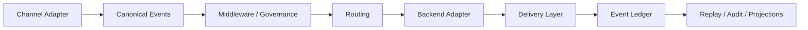

# RFC: CAP Reference Architecture

| | |
|---|---|
| **Status** | Draft |
| **Author** | Claude Code |
| **Audience** | Architects and implementers |
| **Version** | v0.1 |
| **Last Updated** | 2026-03-17 |

## 1. Abstract

This RFC defines the reference architecture for CAP, including the minimum kernel, versioned delivery roadmap, trust boundaries, and subsystem responsibilities.

## 2. Purpose

This RFC defines the recommended reference architecture for CAP.

## 3. Recommended Architecture

`Channel Adapter -> Canonical Event Schema -> Middleware/Governance Pipeline -> Routing Layer -> Backend Agent Adapter -> Delivery Layer -> Event Ledger / Audit / Replay / Observability`

这是本项目的唯一推荐参考架构。

## 4. Minimum Kernel and Versioned Roadmap

### Minimum Kernel
CAP 的最小内核应收敛为 6 个必须组件：
1. one channel adapter
2. one canonical event ledger
3. one middleware / policy stage
4. one route decision stage
5. one backend agent adapter
6. one outbound delivery path

A system that cannot complete this loop is not yet CAP.

### Versioned Roadmap
- **v0 / Protocol Prototype**：stub-to-stub end-to-end
- **v1 / Minimum Kernel**：one real channel + one real backend + replayable governance loop
- **v2 / Enterprise Middleware**：multi-tenant control plane, audit, queue/handoff projections, resilience controls
- **v3 / Product Surface Expansion**：broader channels, richer operator surfaces, optional realtime/media families

## 5. Logical Components

### 1. Control Plane
职责：
- tenant / workspace / channel / credential 管理
- policy / route / quota 配置
- adapter / backend registration
- audit access control

### 2. Gateway / Data Plane
职责：
- ingress / egress adapters
- canonicalization
- middleware execution
- routing invocation
- delivery orchestration

### 3. Agent Adapter Layer
职责：
- HTTP / streaming / MCP / A2A / framework runtime adapters
- runtime session mapping
- tool / handoff / error event mapping

### 4. Event Ledger
职责：
- append-only event store
- replay / audit / history
- conversation state reconstruction inputs
- blocked / denied / retry / dead-letter path retention

Storage strategy:
- use a durable append-capable primary store that can support the event ledger, replay, and audit requirements
- evaluate specific database and queue choices separately based on correctness, operational fit, and throughput needs

Companion stores:
- secure trace store for sensitive raw payload / protocol trace retention
- projections for queue / assignment / latest delivery / latest handoff state

### 5. Identity & Handoff Services
职责：
- external identity mapping
- queue / assignment / operator ownership projection
- handoff lifecycle projection

### 6. Observability
职责：
- structured logs
- traces
- metrics
- event timeline views
- protocol trace capture and correlation

## 6. Architecture Evolution Diagrams

### v0 -> v3 Evolution

```mermaid
flowchart LR
    subgraph V0["v0 / Protocol Prototype"]
        V0A[One Stub Channel Adapter]
        V0B[Canonical Event Schema]
        V0C[One Policy + Route Path]
        V0D[One Stub Backend Adapter]
        V0E[One Outbound Path]
        V0F[Example Ledger]
        V0A --> V0B --> V0C --> V0D --> V0E --> V0F
    end

    subgraph V1["v1 / Minimum Kernel"]
        V1A[Real Channel Adapter]
        V1B[Canonical Event Ledger]
        V1C[Middleware Governance]
        V1D[Rules Router]
        V1E[Real Backend Adapter]
        V1F[Delivery + Retry]
        V1G[Replay + Audit Basics]
        V1A --> V1B --> V1C --> V1D --> V1E --> V1F --> V1G
    end

    subgraph V2["v2 / Enterprise Middleware"]
        V2A[Multi-tenant Control Plane]
        V2B[Governance + Redaction]
        V2C[Queue Assignment Projections]
        V2D[Resilience Controls]
        V2E[Secure Trace Store]
        V2A --> V2B --> V2C --> V2D --> V2E
    end

    subgraph V3["v3 / Product Surface Expansion"]
        V3A[More Channels]
        V3B[More Backend Families]
        V3C[Richer Operator Surfaces]
        V3D[Realtime Voice Media Extensions]
        V3A --> V3B --> V3C --> V3D
    end
```

### Runtime View

## 7. Phase-by-Phase Delivery Guidance

### v0 / Protocol Prototype
- deliver specs
- deliver one stub adapter pair
- validate canonical event sufficiency

### v1 / Minimum Kernel
- real inbound transport
- real outbound delivery
- one backend runtime adapter
- replay + audit basics

### v2 / Enterprise Middleware
- stronger tenancy
- retention / redaction
- queue / assignment projections
- policy and resilience hardening

### v3 / Expanded Surface
- additional channels
- richer admin/operator surfaces
- optional realtime, voice, and advanced protocol trace families

## 8. Versioning Rationale

The phased roadmap exists to control scope and validate the architecture incrementally, not to redefine the core protocol at each version.

A stable CAP core should remain forward-compatible across phases in its essential semantics:
- canonical event envelope
- routing / governance / delivery ownership boundaries
- append-only ledger and replay model
- channel adapter and backend adapter core contracts

The phased roadmap is still necessary because:
- the minimum kernel must be proven before broader product surface is standardized
- enterprise concerns such as redaction, queue projections, and resilience controls should be layered onto a validated event model rather than guessed up front
- optional channel and runtime families should extend capability and event coverage without forcing premature complexity into v1

In short, versions describe **maturity stages of one architecture**, not mutually incompatible architectures.

## 9. Trust Boundaries

### Boundary A: Channel Provider -> Adapter
- verify signature / source
- isolate raw payloads

### Boundary B: Adapter -> Middleware Core
- only canonical events cross inward
- provider-native details stay under `provider_extensions`

### Boundary C: Middleware Core -> Backend Adapter
- only canonical events and structured invocation context cross outward
- framework-private objects never cross back in

### Boundary D: Event Ledger -> Projections / UI
- UI consumes projections
- ledger remains source of truth

## Ownership Model

- **Channel adapters**: translate provider-native ingress / egress
- **Middleware core**: decide / enforce / record
- **Backend adapters**: invoke runtime and map runtime outputs
- **Operator inbox / queue UI**: consume projections, not own truth

Important distinction:
- transport-side abstractions are **channel adapters**
- runtime-side abstractions are **backend agent adapters**
- backend runtimes should not be collapsed into the same top-level abstraction as transport channels in the core protocol

## Sequence Walkthroughs

### 1. Inbound -> Route -> Agent -> Outbound
1. Slack adapter receives webhook
2. Adapter verifies signature and deduplicates
3. Adapter emits `message.received`
4. Middleware enriches tenant / identity / trace context
5. Policy middleware emits `policy.decision.made`
6. Router emits `route.decision.made`
7. Backend adapter receives `agent.invocation.requested`
8. Backend emits `agent.response.completed`
9. Delivery layer emits `message.send.requested` and `message.sent`
10. Ledger, audit, trace persist the chain

### 2. Policy Reject
1. Adapter emits `message.received`
2. Governance middleware evaluates policy
3. Middleware emits `policy.decision.made` with `deny`
4. Optional outbound explanation is emitted
5. No backend invocation occurs

### 3. Streaming Response
1. Backend adapter receives invocation
2. Backend emits `agent.response.delta` repeatedly
3. Delivery layer translates partial output if channel supports streaming
4. Backend emits `agent.response.completed`
5. Delivery finalization updates status

### 4. Human Handoff
1. Backend emits `handoff.requested`
2. Middleware routes to queue projection
3. Projection marks active queue / assignment state
4. Operator replies through operator UI
5. Outbound adapter sends reply
6. Later `handoff.completed` can return conversation to automation

### 5. Duplicate Webhook + Retry / Dead-Letter
1. Adapter receives duplicate provider event
2. Ingress idempotency rejects duplicate canonical append
3. Middleware records auditable blocked / dedupe outcome
4. If outbound delivery fails retryably, middleware retries
5. If retries exhausted, emit `error.occurred` and terminal delivery state

## Build-vs-Adopt

- **Gateway / control plane**：自研；参考 OpenClaw
- **Canonical protocol / event schema**：自研；参考 Bot Framework + Rasa
- **Channel adapter SDK / contract**：自研；参考 Bot Framework + opsdroid + Omni
- **Backend agent adapter contract**：自研；参考 Agent Kernel
- **Event ledger / replay / audit**：自研逻辑，底层存储实现单独选型，不在本 RFC 中预设为某个数据库
- **企业运营 / inbox / handoff 经验**：借鉴 Chatwoot / Chaskiq，不直接照搬产品模型
- **完整现成底座复用**：当前不建议直接选单一项目作为基础底座

## Recommended v1 Scope

### Channels
- at least one real inbound/outbound channel path
- channel selection should be decided in a separate implementation decision, not fixed by this RFC

### Backends
- at least one real backend adapter path
- backend adapter shape should be decided in a separate implementation decision, not fixed by this RFC

### Infra
- no storage engine is mandated by this RFC
- no mandatory broker in v1

### Governance
- basic tenant policy
- audit log
- handoff projection
- redaction labels
- retry / dead-letter handling

## 10. Conformance

A conforming CAP architecture MUST include the minimum kernel loop and preserve the ownership boundaries described in this RFC.

## 11. Security Considerations

The architecture SHOULD:
- isolate provider-native raw payload handling from the canonical ledger where sensitivity requires it
- preserve tenant isolation at control-plane and data-plane boundaries
- treat backend execution privileges as explicit policy, not ambient trust
- keep projections disposable and reconstructable from durable facts

## 12. Open Questions

- At what point should execution isolation become a first-class architectural component rather than an implementation policy?
- Should a separate observability RFC define protocol trace lifecycle and retention more formally?
- Which v2 enterprise features must be normative before CAP can claim production-ready status?

## 13. Final Decision

本项目的实现路线应收敛为：

**组合借鉴多个项目的架构模式，自研中间层。**