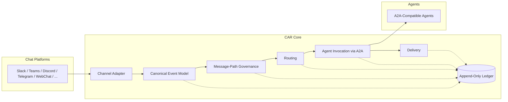

# RFC: Chat Agent Relay Reference Architecture

| | |
|---|---|
| **Status** | Draft |
| **Author** | Claude Code |
| **Audience** | Architects and implementers |
| **Version** | v0.3 |
| **Last Updated** | 2026-04-02 |

## 1. Abstract

This RFC defines the reference architecture for Chat Agent Relay (CAR). CAR is a standard relay layer between chat platforms and agents. It standardizes the message path through canonical events, governance, routing, agent invocation, delivery, and an append-only audit ledger.

On the agent side, CAR uses the A2A protocol as the standard integration boundary.

This document intentionally separates the architecture into three layers:
- **Core** — normative architecture that defines CAR's identity and conformance center
- **Extension** — architecture that is aligned with CAR but optional or not required for every conforming implementation
- **Future Considerations** — long-range product and ecosystem directions that are not current normative requirements

## 2. Purpose

This RFC defines the recommended long-range architecture map for CAR while making the normative center explicit.

## 3. Product Boundary

CAR is:
- a standard relay layer between chat platforms and agents
- a canonical-event-centered message pipeline
- a governance, routing, delivery, and audit layer on the message path
- a self-hosted system with replayable, append-only system history

CAR is not:
- an agent runtime or orchestration framework
- an agent-internal governance or tool-execution control plane
- an inbox, CRM, or SaaS workspace product

## 4. Layering Model

### 4.1 Core

Core architecture defines what a conforming CAR system fundamentally is. When this document uses normative language about CAR identity, it applies to this layer.

### 4.2 Extension

Extension architecture covers optional capabilities that fit the CAR model without redefining it. These may be standardized, but they are not required for every CAR implementation.

### 4.3 Future Considerations

Future considerations preserve useful long-range architecture direction. They are intentionally non-normative and MUST NOT be treated as required for conformance.

## 5. Core Architecture

### 5.1 Core Architecture Statement

The core CAR architecture is:

`Channel Adapter -> Canonical Event Model -> Message-Path Governance -> Routing -> Agent Invocation via A2A -> Delivery -> Append-Only Ledger / Replay / Audit`

A system that cannot complete this loop is not yet CAR.

### 5.2 Core Responsibilities

A conforming CAR core MUST preserve these responsibilities:
- receive inbound traffic from chat platforms through channel adapters
- canonicalize inbound traffic into the CAR event model
- execute governance on the message path
- produce route decisions
- invoke agents through the agent-side integration boundary
- translate and perform outbound delivery
- append auditable events to a replayable ledger

### 5.3 Core Logical Components

#### 1. Channel Boundary
Responsibilities:
- ingress and egress integration with chat platforms
- source verification where applicable
- canonicalization into CAR events
- adaptation to channel-specific delivery capabilities

#### 2. Canonical Event Model
Responsibilities:
- define the common event envelope and event families
- preserve correlation and causation across the message path
- keep provider-native details in structured extensions rather than the core model

#### 3. Message-Path Governance
Responsibilities:
- evaluate policy on inbound messages before routing
- evaluate policy on outbound messages before delivery
- keep governance decisions explainable from recorded events

#### 4. Routing Layer
Responsibilities:
- select the appropriate agent for a message
- preserve auditable route decisions as part of the event chain

#### 5. Agent Integration Boundary
Responsibilities:
- invoke agents through a stable protocol boundary
- map agent results back into canonical events
- preserve session and capability semantics relevant to the relay path

**Agent-side standard:** CAR uses **A2A** as the standard agent-side protocol boundary.

#### 6. Delivery Layer
Responsibilities:
- translate canonical outbound intent into channel actions
- handle retry and terminal delivery outcomes
- record delivery-related events for replay and audit

#### 7. Append-Only Ledger
Responsibilities:
- retain the immutable event history of the message path
- support replay, audit, and decision explanation
- remain the source of truth for reconstructing what happened

### 5.4 Core Runtime View

```mermaid
flowchart LR
    subgraph Channels["Chat Platforms"]
      CP["Slack / Teams / Discord / Telegram / WebChat / ..."]
    end

    subgraph CAR["CAR Core"]
      CA["Channel Adapter"]
      CE["Canonical Event Model"]
      GOV["Message-Path Governance"]
      RT["Routing"]
      A2A["Agent Invocation via A2A"]
      DL["Delivery"]
      EL[("Append-Only Ledger")]
    end

    subgraph Agents["Agents"]
      AG["A2A-Compatible Agents"]
    end

    CP --> CA --> CE --> GOV --> RT --> A2A --> DL
    A2A --> AG
    CE -.-> EL
    GOV -.-> EL
    RT -.-> EL
    A2A -.-> EL
    DL -.-> EL
```

### 5.5 Core Versioned Maturity

The reference architecture evolves in maturity without changing the identity of the core system:
- **v0 / Protocol Prototype** — prove the canonical relay loop end to end
- **v1 / Minimum Relay Kernel** — one real channel path, one real agent path, replayable governance loop
- **v2 / Enterprise Hardening** — stronger governance, security, tenancy, and operational depth around the same core relay model
- **v3 / Product Surface Expansion** — broader supporting capabilities built around the same core relay model

Versions describe maturity stages of one relay architecture, not different products.

## 6. Extension Architecture

Extension architecture is aligned with CAR but not required to define CAR's core identity.

### 6.1 Identity Extensions
Potential extension responsibilities:
- external identity mapping
- cross-channel identity association where policy allows
- explicit identity-resolution outcomes recorded as events

Identity capabilities are useful, but CAR does not require cross-channel identity stitching to remain CAR.

### 6.2 Handoff Extensions
Potential extension responsibilities:
- optional handoff-request events
- optional human-assisted continuation of a conversation
- event-modeled transitions when automation yields to another execution path

Handoff support MAY exist, but inbox-style queue management is not part of CAR's core identity.

### 6.3 Richer Channel and Delivery Capabilities
Potential extension responsibilities:
- richer message abstractions
- richer streaming models
- enhanced channel-native interaction primitives
- richer delivery state projections

### 6.4 Enhanced Operational Controls
Potential extension responsibilities:
- stronger tenancy controls
- richer policy families
- more advanced rate limiting and resilience controls
- richer operational management surfaces

### 6.5 Observability Extensions
Potential extension responsibilities:
- protocol trace references
- richer metrics and tracing systems
- deeper operational observability beyond the core audit ledger

These support operations, but they do not replace the append-only event ledger as the core accountability mechanism.

## 7. Future Considerations

The following themes are intentionally non-normative in this RFC. They preserve architectural direction but MUST NOT be read as current conformance requirements.

### 7.1 Operator and Inbox Product Surfaces
Possible future directions:
- queue projections
- assignment projections
- richer operator workflow surfaces
- inbox-like operating experiences layered on top of CAR events

These are downstream product surfaces, not the normative definition of CAR itself.

### 7.2 Expanded Control Plane Surfaces
Possible future directions:
- more elaborate administrative UX
- richer multi-tenant control-plane products
- policy management products layered above the relay core

### 7.3 Companion Trace Stores
Possible future directions:
- secure raw-payload trace stores
- protocol-trace buffering systems
- forensic stores correlated with the canonical ledger

These may be valuable, but the canonical event ledger remains the architectural center of gravity.

### 7.4 Broader Ecosystem Expansion
Possible future directions:
- broader ecosystem tooling around CAR
- richer non-core integration patterns
- additional platform experiences around the relay layer

Such expansion MUST NOT blur the core boundary that CAR is a standard relay layer between chat platforms and agents.

## 8. Trust Boundaries

### Boundary A: Chat Platform -> Channel Adapter
- treat provider traffic as untrusted input
- verify source authenticity where applicable
- normalize provider-native payloads before they enter the CAR core

### Boundary B: Channel Adapter -> Core Message Path
- only canonical events and structured delivery abstractions cross inward
- provider-native details remain under structured extensions

### Boundary C: Core Message Path -> Agent Boundary
- the core invokes agents through the A2A protocol boundary
- runtime-private agent internals do not become CAR core semantics

### Boundary D: Ledger -> Projections and External Surfaces
- downstream views consume derived data or replay output
- the append-only ledger remains the durable source of truth

## 9. Ownership Model

- **Channel adapters** translate provider-native chat traffic into and out of the CAR message path
- **CAR core** decides, enforces, routes, delivers, and records
- **Agent integrations** invoke agents through the A2A boundary and map results back into canonical events
- **Downstream surfaces** such as admin tools, dashboards, or operator experiences consume the relay system but do not define its core truth

## 10. Sequence Walkthroughs

### 10.1 Standard Relay Path
1. A channel adapter receives inbound traffic
2. The adapter canonicalizes it into a CAR event
3. Governance evaluates inbound policy
4. Routing selects an agent
5. CAR invokes the agent through A2A
6. The result is mapped into canonical events
7. Delivery sends the response to the chat platform
8. The ledger records the chain for replay and audit

### 10.2 Governance Reject Path
1. A channel adapter emits an inbound canonical event
2. Governance evaluates policy
3. CAR records the governance decision
4. CAR records the blocked outcome when appropriate
5. No agent invocation occurs

### 10.3 Delivery Failure Path
1. CAR produces outbound delivery intent from the agent result
2. Delivery attempts channel transmission
3. Retry policy handles retryable failures
4. Terminal failure is recorded in auditable form

### 10.4 Streaming or Resumable Relay Path
1. CAR invokes an agent through the agent-side boundary
2. The agent emits streaming or resumable output when supported
3. CAR maps that behavior into canonical and delivery semantics
4. The ledger preserves the auditable record of the path

## 11. Recommended Implementation Priorities

### Core-first priorities
Implementations SHOULD prioritize:
- one real channel path
- one real A2A agent path
- canonical event recording
- inbound and outbound governance checkpoints
- routing
- delivery with replayable outcomes
- audit and replay basics

### Extension-next priorities
Implementations MAY then add:
- identity extensions
- optional handoff events
- richer streaming and channel capabilities
- stronger tenancy and operational controls

### Future-facing priorities
Implementations MAY explore product surfaces beyond the relay core, but these SHOULD remain explicitly layered above the normative architecture.

## 12. Conformance

A conforming CAR architecture MUST:
- preserve the relay identity between chat platforms and agents
- use canonical events as the center of the message path
- execute governance, routing, agent invocation, delivery, and recording as first-class responsibilities
- treat the append-only ledger as the source of replay and audit truth
- use A2A as the standard agent-side protocol boundary

A conforming CAR architecture is NOT required to provide every extension or future consideration described in this RFC.

## 13. Security Considerations

Implementations SHOULD:
- verify and isolate untrusted provider traffic at the channel boundary
- preserve tenant and policy boundaries consistently on the message path
- keep governance decisions explainable from durable records
- avoid turning downstream product surfaces into hidden sources of truth
- preserve the distinction between CAR's relay responsibilities and agent-internal execution responsibilities

## 14. Open Questions

- Which extension topics should eventually graduate into their own dedicated RFCs?
- Which observability extensions need stronger standardization versus remaining implementation guidance?
- Where should future product-surface ideas be separated into non-core RFC tracks so the core relay architecture remains clear?

## 15. Final Decision

The implementation path for this project SHOULD converge on one architecture:

**CAR is a standard relay layer between chat platforms and agents, centered on canonical events, message-path governance, A2A agent invocation, delivery, and append-only auditability.**