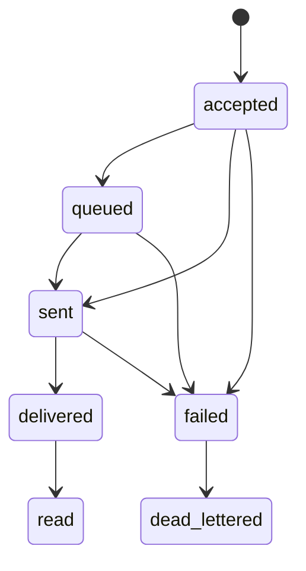
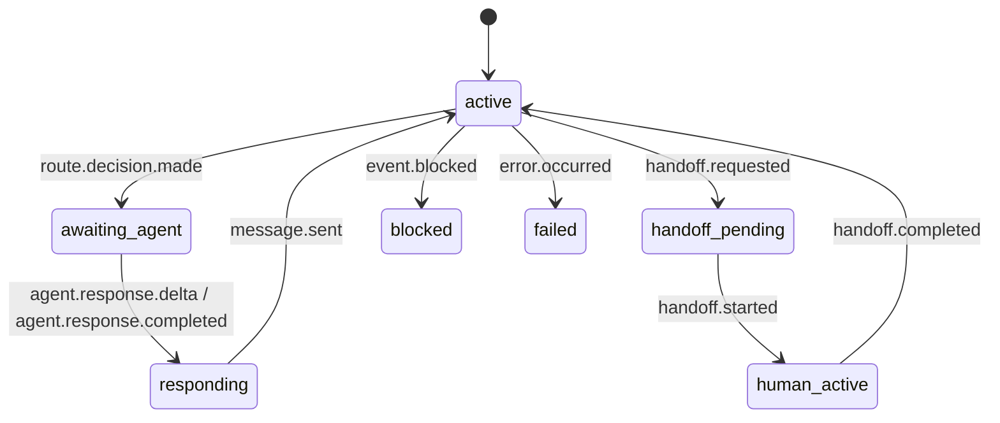

# RFC: Chat Agent Relay Canonical Event Schema

| | |
|---|---|
| **Status** | Draft |
| **Author** | Claude Code |
| **Audience** | CAR core / adapter / backend implementers |
| **Version** | v0.1 |
| **Last Updated** | 2026-03-17 |
|

## 1. Abstract

This RFC defines the Chat Agent Relay (CAR) canonical event envelope as the protocol center of gravity for the system.

## 2. Purpose

This document defines the platform's single source of system truth: the **canonical event envelope**.

All channel adapters, backend agent adapters, routing, governance, audit, replay, delivery, and handoff MUST operate around this model.

## 3. Normative Language

The key words **MUST**, **MUST NOT**, **SHOULD**, **SHOULD NOT**, and **MAY** are to be interpreted as described in RFC 2119.

## 4. Scope

This RFC defines the canonical event envelope for CAR. It is the source of truth for channel adapters, backend agent adapters, governance, routing, audit, replay, and projections.

## 5. Design Principles

- Events are **append-only and replayable**
- All internal routing, audit, and policy decisions operate solely on canonical events
- Conversation state is reconstructed from the event ledger, not overwritten as a mutable store
- Channel differences are preserved via `provider_extensions`, not forcefully flattened
- Delivery semantics use **at-least-once + idempotency**, not exactly-once
- REST / WebSocket / MCP / RPC are all bindings of the same canonical model, not independent protocols

## 6. Minimal Kernel Relevance

The canonical event schema is part of the **minimum CAR kernel**. A conforming minimum kernel MUST support:
- canonical inbound message events
- policy and route decision events
- backend invocation and response events
- outbound delivery events
- blocked / denied event recording
- correlation / causation / trace propagation

The minimum kernel does NOT require every future event family before v1, but it MUST preserve forward-compatible extension points.

## 7. Envelope

```json
{
  "event_id": "evt_01H...",
  "schema_version": "v1alpha1",
  "event_type": "message.received",
  "tenant_id": "tenant_acme",
  "workspace_id": "ws_support",
  "channel": "slack",
  "channel_instance_id": "slack_support_prod",
  "conversation_id": "conv_123",
  "thread_id": "thr_123",
  "session_id": "sess_123",
  "message_id": "msg_123",
  "correlation_id": "corr_123",
  "causation_id": "evt_prev",
  "trace_context": {
    "trace_id": "trace_123",
    "span_id": "span_123",
    "parent_span_id": "span_122"
  },
  "occurred_at": "2026-03-17T12:00:00Z",
  "actor": {
    "id": "user_ext_42",
    "display_name": "Alice"
  },
  "actor_type": "end_user",
  "identity_refs": {
    "channel_user_id": "U123",
    "platform_principal_id": "principal_42"
  },
  "payload": {
    "text": "hello"
  },
  "attachments": [],
  "provider_extensions": {
    "slack": {
      "team_id": "T123",
      "raw_event_type": "app_mention"
    }
  },
  "governance_labels": ["contains_pii:false", "tenant_policy:default"]
}
```

## Required Fields

### Identity and trace
- `event_id`
- `schema_version`
- `tenant_id`
- `workspace_id`
- `channel`
- `channel_instance_id`
- `conversation_id`
- `session_id`
- `correlation_id`
- `occurred_at`

### Optional but strongly recommended
- `thread_id`
- `message_id`
- `causation_id`
- `trace_context`
- `identity_refs`
- `attachments`
- `provider_extensions`
- `governance_labels`

## Actor Types

Allowed values:
- `end_user`
- `agent`
- `human_operator`
- `system`
- `channel_adapter`

## Event Types

### Messaging
- `message.received`
- `message.send.requested`
- `message.sent`
- `message.delivery.updated`

### Routing and policy
- `route.decision.made`
- `policy.decision.made`

### Agent lifecycle
- `agent.invocation.requested`
- `agent.response.delta`
- `agent.response.completed`

### Tools
- `tool.call.requested`
- `tool.result.received`

### Human handoff
- `handoff.requested`
- `handoff.started`
- `handoff.completed`

### Identity / audit / error
- `identity.linked`
- `identity.resolution.requested`
- `identity.resolution.completed`
- `identity.resolution.ambiguous`
- `identity.resolution.challenge.sent`
- `audit.annotation.added`
- `error.occurred`
- `event.blocked`

## Metadata Layers

To avoid conflating configuration and binding information with event facts, the platform SHOULD maintain three metadata boundary layers:

1. **Channel Instance Metadata**
   - Scope: `channel_instance_id`
   - Examples: provider name, tenant-scoped credentials, default rate limit, default delivery config
2. **Conversation / Route Binding Metadata**
   - Scope: a specific conversation / thread / route binding
   - Examples: persona, locale, visibility override, handoff policy, segment tags
3. **Event-Level Provider Metadata**
   - Scope: a single canonical event
   - Location: `provider_extensions`
   - Examples: provider message id, provider event type, native receipt fields, callback payload digest

The protocol layer MUST NOT conflate these three layers; the event ledger stores only event facts and necessary references, without copying all static configuration into every event.

## Payload Conventions

### `payload`
Canonical business content. Common shapes:
- text
- structured object
- action metadata
- delivery status
- route result
- policy result
- tool call/result
- handoff metadata
- error metadata
- identity resolution result
- queue / assignment projection input

### `attachments`
Normalized attachment descriptors:
- `attachment_id`
- `kind`
- `mime_type`
- `url` or `blob_ref`
- `size_bytes`
- `caption`

### `provider_extensions`
Preserve provider-native fields without leaking them into the canonical core.

Rules:
- namespaced by provider or integration key
- optional
- never required by middleware core semantics
- may be consumed by adapters or specialized policies
- should prefer references / selected structured fields over full raw payload embedding
- highly sensitive provider-native raw payloads SHOULD be stored in a secure trace store and referenced indirectly when needed

## Ordering and Idempotency

- Every event should carry a stable `event_id`
- Ingest adapters should also derive a provider idempotency key when possible
- Consumers must be idempotent
- Ordering is best-effort within a `(tenant_id, conversation_id, channel_instance_id)` scope
- The platform does not guarantee global total ordering

## Delivery State Model

`message.delivery.updated.payload.status` should use one of:
- `accepted`
- `queued`
- `sent`
- `delivered`
- `read`
- `failed`
- `dead_lettered`

### Delivery State Machine


## Identity Resolution State Model

Identity-related payloads should use one of:
- `identified`
- `ambiguous`
- `unknown`
- `challenge_sent`
- `rejected`

The platform MAY provide an identity resolution pipeline, but MUST write final results as canonical events for audit / replay use.

## Blocked and Rejected Event Semantics

The following situations SHOULD NOT be silently discarded; they SHOULD enter the ledger:
- policy deny
- dedupe / idempotency rejection
- invalid state transition
- chain-depth / recursion protection
- provider capability rejection

Recommended unified approach:
- original triggering event + `policy.decision.made` / `event.blocked`
- `payload.reason`
- `payload.block_stage`
- `payload.retryable`

## Conversation State Reconstruction

The canonical source of truth is the event ledger. Projections may derive:
- current conversation status
- active route
- current handoff state
- current assignee / queue
- latest delivery state
- latest linked identities

These projections are disposable and rebuildable.

### Conversation State Machine


## Example Ledger

### 1. inbound message
```json
{
  "event_id": "evt_100",
  "event_type": "message.received",
  "tenant_id": "tenant_acme",
  "workspace_id": "ws_support",
  "channel": "slack",
  "channel_instance_id": "slack_support_prod",
  "conversation_id": "conv_1",
  "session_id": "sess_1",
  "correlation_id": "corr_1",
  "occurred_at": "2026-03-17T12:00:00Z",
  "actor": {"id": "U123"},
  "actor_type": "end_user",
  "payload": {"text": "Where is my order?"}
}
```

### 2. policy decision
```json
{
  "event_id": "evt_101",
  "event_type": "policy.decision.made",
  "tenant_id": "tenant_acme",
  "workspace_id": "ws_support",
  "conversation_id": "conv_1",
  "session_id": "sess_1",
  "correlation_id": "corr_1",
  "causation_id": "evt_100",
  "occurred_at": "2026-03-17T12:00:01Z",
  "actor_type": "system",
  "payload": {"policy": "default_ingress", "decision": "allow"}
}
```

### 3. route decision
```json
{
  "event_id": "evt_102",
  "event_type": "route.decision.made",
  "tenant_id": "tenant_acme",
  "workspace_id": "ws_support",
  "conversation_id": "conv_1",
  "session_id": "sess_1",
  "correlation_id": "corr_1",
  "causation_id": "evt_101",
  "occurred_at": "2026-03-17T12:00:01Z",
  "actor_type": "system",
  "payload": {"route": "support-agent", "reason": "default_support_route"}
}
```

### 4. agent invocation
```json
{
  "event_id": "evt_103",
  "event_type": "agent.invocation.requested",
  "tenant_id": "tenant_acme",
  "workspace_id": "ws_support",
  "conversation_id": "conv_1",
  "session_id": "sess_1",
  "correlation_id": "corr_1",
  "causation_id": "evt_102",
  "occurred_at": "2026-03-17T12:00:02Z",
  "actor_type": "system",
  "payload": {"backend": "http-agent", "input_event_id": "evt_100"}
}
```

### 5. agent response
```json
{
  "event_id": "evt_104",
  "event_type": "agent.response.completed",
  "tenant_id": "tenant_acme",
  "workspace_id": "ws_support",
  "conversation_id": "conv_1",
  "session_id": "sess_1",
  "correlation_id": "corr_1",
  "causation_id": "evt_103",
  "occurred_at": "2026-03-17T12:00:04Z",
  "actor": {"id": "agent_support"},
  "actor_type": "agent",
  "payload": {"text": "Your order shipped yesterday."}
}
```

### 6. outbound delivery
```json
{
  "event_id": "evt_105",
  "event_type": "message.sent",
  "tenant_id": "tenant_acme",
  "workspace_id": "ws_support",
  "channel": "slack",
  "channel_instance_id": "slack_support_prod",
  "conversation_id": "conv_1",
  "session_id": "sess_1",
  "correlation_id": "corr_1",
  "causation_id": "evt_104",
  "occurred_at": "2026-03-17T12:00:05Z",
  "actor_type": "channel_adapter",
  "payload": {"provider_message_id": "slack_msg_555"}
}
```

### 7. optional human handoff
```json
{
  "event_id": "evt_106",
  "event_type": "handoff.requested",
  "tenant_id": "tenant_acme",
  "workspace_id": "ws_support",
  "conversation_id": "conv_1",
  "session_id": "sess_1",
  "correlation_id": "corr_1",
  "causation_id": "evt_104",
  "occurred_at": "2026-03-17T12:00:06Z",
  "actor_type": "agent",
  "payload": {"queue": "human_support", "reason": "low_confidence"}
}
```

## 8. Versioning and Phased Adoption

### Phase 0 / Prototype
- `message.received`
- `policy.decision.made`
- `route.decision.made`
- `agent.invocation.requested`
- `agent.response.completed`
- `message.send.requested`
- `message.sent`
- `error.occurred`

### Phase 1 / Minimum Kernel
Adds:
- `message.delivery.updated`
- `event.blocked`
- `handoff.requested`
- `handoff.started`
- `handoff.completed`
- identity resolution events

### Phase 2 / Enterprise Control Plane
Adds:
- richer audit annotations
- queue / assignment projection inputs
- policy families beyond allow/deny
- protocol trace references

### Phase 3 / Rich and Realtime Extensions
Adds optional extensions for:
- richer channel-native content
- voice / media semantics
- advanced protocol trace families

## 9. Non-Goals

- Does not attempt to fully unify all provider-native features in v1
- Does not promise exactly-once delivery
- Does not treat UI-private state as a protocol source of truth

## 10. Conformance

A conforming CAR implementation MUST:
- produce canonical events for the minimum kernel flow
- preserve correlation / causation / trace semantics
- distinguish canonical events from provider-native extensions
- record blocked / denied outcomes in an auditable way

## 11. Security Considerations

Implementations SHOULD:
- avoid embedding sensitive raw payloads directly in every canonical event
- store sensitive provider traces in a secure companion store
- scope access to event and projection data by tenant and workspace
- preserve auditability while supporting redaction of downstream views

## 12. Open Questions

- Should conversation-local sequence numbers become normative in v1 or remain projection-only?
- Which identity resolution outcomes require mandatory dedicated event types versus payload-encoded state?
- How much protocol trace linkage should be standardized in the core schema versus extension documents?