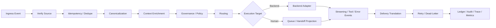

# RFC: CAP Routing, Middleware, and Governance

| | |
|---|---|
| **Status** | Draft |
| **Author** | Claude Code |
| **Audience** | CAP core / governance / routing implementers |
| **Version** | v0.1 |
| **Last Updated** | 2026-03-17 |

## 1. Abstract

This RFC defines the ordered processing pipeline and governance responsibilities of the CAP middleware core.

## 2. Purpose

This RFC defines the middleware layer's fixed processing pipeline and governance boundaries that enterprises can operationalize.

## 3. Normative Language

The key words **MUST**, **MUST NOT**, **SHOULD**, **SHOULD NOT**, and **MAY** are to be interpreted as described in RFC 2119.

## 4. Minimum Kernel

The minimum CAP kernel is not a full omnichannel product. It is the smallest coherent middleware loop that proves the architecture:
- one inbound adapter
- canonical append-only ledger
- one policy stage
- one routing stage
- one backend adapter
- one outbound delivery path
- auditable blocked / failed outcomes

The minimum kernel explicitly excludes, for v0/v1, full CRM-like inbox behavior, broad channel coverage, and heavyweight realtime media subsystems.

## 5. Ordered Processing Pipeline

1. Receive inbound channel events
2. Verify signatures / source authentication
3. Idempotency and deduplication of duplicate webhooks
4. Normalize to canonical events
5. Enrich tenant / identity / conversation / trace context
6. Execute governance and policy middleware
7. Produce route decision
8. Enter backend agent adapter or human queue
9. Handle streaming replies / tool events / error events
10. Translate to outbound channel actions
11. Execute delivery / retry / dead-letter logic
12. Record event ledger / trace / audit / metrics

### Pipeline Diagram

## Middleware Stages

### Stage A: Ingress Safety
- signature verification
- source auth
- schema validation
- idempotency key derivation
- protocol trace capture / secure raw payload reference creation if needed

### Stage B: Context Enrichment
- tenant resolution
- workspace resolution
- conversation lookup or creation
- identity stitching lookup
- identity resolution state evaluation (`identified` / `ambiguous` / `unknown` / `challenge_sent` / `rejected`)
- trace context creation or propagation

### Stage C: Governance
- tenant policy load
- moderation / compliance checks
- redaction / PII labeling
- tool restrictions
- approval gating

### Stage D: Routing
- static route rules
- rules-based route
- capability-based route
- handoff / escalation route

### Stage E: Backend / Human Execution
- invoke backend adapter
- or enqueue to human queue
- capture streaming / tool / error events

### Stage F: Delivery and Recording
- channel capability adaptation
- outbound delivery execution
- retry / dead-letter orchestration
- append audit and observability records

## Governance Requirements

### Tenant boundaries
Must be tenant-scoped:
- credentials
- routing rules
- moderation / policy config
- logs / audit visibility
- quotas and rate limits

### PII / Redaction / Governance Labels
Governance middleware may:
- add `governance_labels`
- redact projected views
- block unsafe outbound actions

Canonical events should preserve auditability even when downstream views are redacted.

### Policy Checkpoints
Required checkpoints:
- **pre-route policy check**
- **pre-send policy check**

Optional checkpoints:
- pre-tool execution
- pre-handoff completion

### Human Handoff / Queue / Assignment
The platform should model these as canonical-event-driven projections, not UI-private fields.

Relevant projection state:
- current queue
- current assignee
- handoff status
- escalation reason
- handoff start / end timestamps

These should be reconstructed from events such as:
- `handoff.requested`
- `handoff.started`
- `handoff.completed`
- `audit.annotation.added`

## Identity Stitching

Platform responsibility:
- maintain external-to-platform identity references
- associate multiple provider identities when tenant policy allows
- keep identity linkage explicit and auditable

Platform should not assume automatic cross-channel identity merging unless configured.

## Replay and Event History

Replay scope must support:
- single conversation
- time-bounded event range
- route / handoff / delivery reconstruction
- audit explanation of why a decision occurred
- blocked / denied / retried / dead-lettered path reconstruction

Replay should not depend on hidden mutable UI state.

Blocked or denied actions MUST remain explainable from ledger contents.

## Resilience Controls

The middleware should define first-class resilience controls:
- retry policy
- circuit breaker per adapter / instance
- per-tenant and per-instance rate limits
- conversation-scoped locking or serialization for idempotent processing
- processing timeout budget

Idempotency checks should happen inside the same serialized processing scope used for canonical append decisions.

## Protocol Trace vs Canonical Event

The platform SHOULD distinguish two classes of record:
- **canonical event**: business and governance facts, used for routing / policy / replay / audit
- **protocol trace**: transport / provider-layer interaction facts, used for debugging, operations, and forensic analysis

Protocol trace MAY arrive before conversation resolution; when necessary it MAY be buffered first and then correlated after conversation context is established. The protocol layer SHOULD NOT embed raw trace payloads wholesale into canonical events.

## Audit Minimum Fields

Every auditable decision should capture at least:
- `event_id`
- `tenant_id`
- `workspace_id`
- `conversation_id`
- decision type
- decision result
- actor / actor_type
- timestamp
- policy or rule reference
- correlation / causation identifiers

## Delivery Semantics

- internal processing: at-least-once
- consumer contract: idempotent
- retries: middleware-managed
- dead-letter: explicit terminal state
- duplicate webhook handling: before route execution
- blocked or rejected outbound actions must still produce auditable records

## Ownership Boundary

- **adapters** are responsible for `translate`
- **middleware core** is responsible for `decide / enforce / record`
- **backend adapters** are responsible for runtime invocation
- **operator / inbox** is only the consumption surface for handoff, not the source of core state

## 6. Versioning and Delivery Phases

### Phase 0 / Protocol Prototype
- one stub channel adapter
- one stub backend adapter
- one route rule
- one ledger walkthrough
- one denied / blocked path

### Phase 1 / Minimum Kernel
- real web chat or Slack-class adapter
- basic tenant policy
- idempotent ingress
- replayable ledger
- handoff events without full operator suite

### Phase 2 / Enterprise Middleware
- multi-tenant control plane
- assignment / queue projections
- stronger audit / retention / redaction
- circuit breaker / retry / quota controls
- secure trace store integration

### Phase 3 / Rich Product Surface
- broader channels
- richer operator experiences
- advanced policy DSL
- optional realtime / media families

## 7. Build-v1 Guidance

v1 should include:
- ingress auth + idempotency
- canonical event append
- one policy stage
- one rules router
- one backend adapter path
- one human queue projection path
- one outbound delivery path
- audit and trace emission

v1 should defer:
- very advanced policy DSL
- exactly-once semantics
- cross-region active-active ordering guarantees

## 8. Conformance

A conforming middleware core MUST:
- execute the ordered processing pipeline consistently
- record blocked / denied / failed outcomes in an auditable form
- keep governance decisions explainable from ledger contents
- separate protocol trace concerns from canonical business-event concerns

## 9. Security Considerations

Implementations SHOULD:
- enforce tenant-scoped policy and credentials consistently
- support redaction without destroying auditability
- ensure idempotency checks occur inside the same serialized processing scope as append decisions
- treat handoff, assignment, and queue state as governed projections rather than UI-owned truth

## 10. Open Questions

- Which governance stages should be mandatory in v1 versus recommended in v2?
- How much of assignment / queue projection semantics belongs in the core RFC versus extension RFCs?
- Should protocol trace buffering be standardized here or in a separate observability RFC?