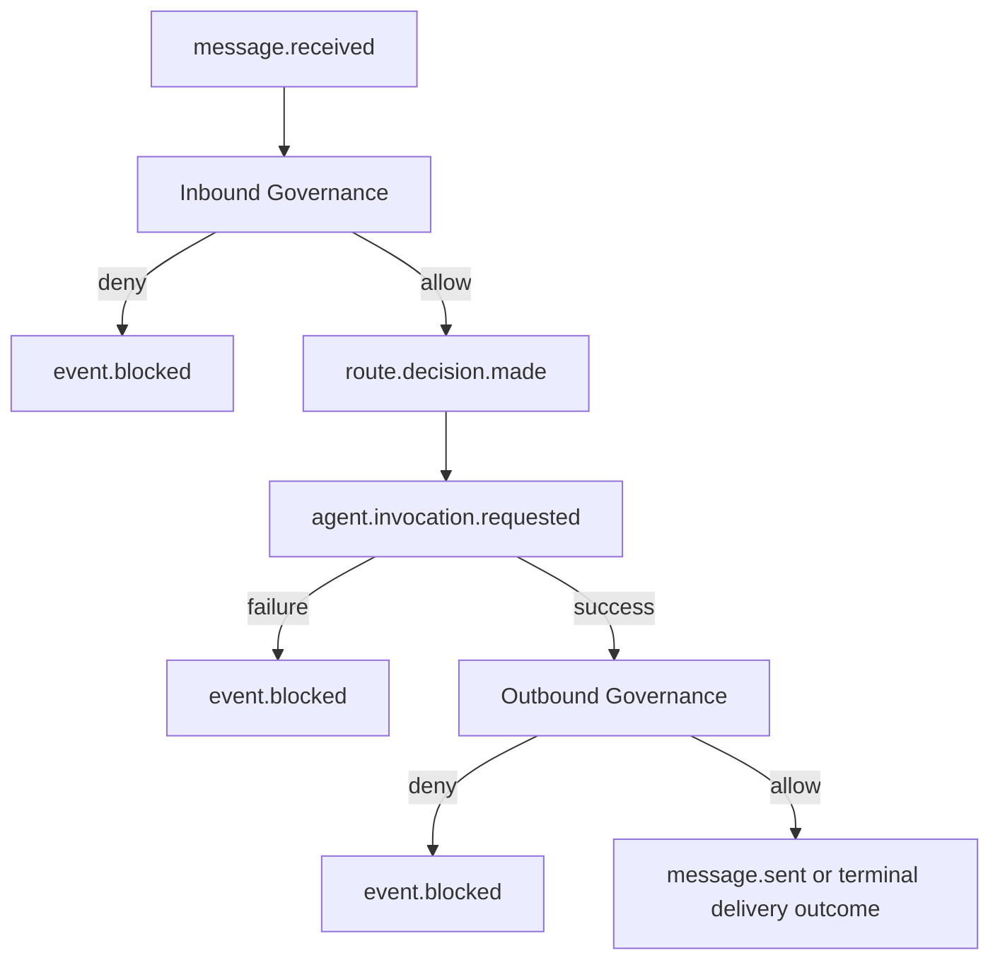

# RFC: Chat Agent Relay Routing, Middleware, and Governance

| | |
|---|---|
| **Status** | Draft |
| **Author** | Claude Code |
| **Audience** | CAR core / governance / routing implementers |
| **Version** | v0.2 |
| **Last Updated** | 2026-04-02 |

## 1. Abstract

This RFC defines the ordered message-path processing model for Chat Agent Relay (CAR).

CAR is a standard relay layer between chat platforms and agents. Within that relay path, CAR applies governance, records routing decisions, invokes agents through the agent-side boundary, orchestrates delivery, and preserves an auditable event history.

This document explicitly separates:
- **Core** — normative message-path semantics that define CAR's middleware identity
- **Extension** — optional but aligned middleware semantics
- **Future Considerations** — longer-range directions that are not current conformance requirements

## 2. Purpose

This RFC defines the fixed middleware responsibilities and ordered processing semantics that make CAR a governed, replayable chat-to-agent relay system.

## 3. Product Boundary

For this RFC, CAR middleware is responsible for:
- processing the message path between chat platforms and agents
- enforcing governance on that message path
- recording routing and delivery outcomes in auditable form

For this RFC, CAR middleware is not:
- an agent runtime or orchestration layer
- an agent-internal tool approval or reasoning governance system
- an operator inbox, queue-management product, or SaaS workspace

## 4. Layering Model

### 4.1 Core

Core semantics define the minimum governed relay path that a conforming CAR middleware implementation MUST preserve.

### 4.2 Extension

Extension semantics add useful capabilities that fit the CAR model but are not required for every conforming implementation.

### 4.3 Future Considerations

Future considerations preserve architectural direction, but MUST NOT be interpreted as current required middleware semantics.

## 5. Core Message-Path Pipeline

### 5.1 Core Pipeline Statement

The CAR middleware core MUST preserve this ordered message path:

1. Receive inbound channel events
2. Verify source authenticity where applicable
3. Normalize to canonical events
4. Enrich relay context needed for the message path
5. Execute inbound governance
6. Produce route decision
7. Invoke the agent through the agent-side boundary
8. Process agent result into canonical outbound intent
9. Execute outbound governance
10. Execute delivery and retry behavior
11. Record auditable outcomes in the append-only ledger

A conforming implementation MAY add extension stages, but MUST NOT break the meaning or order of the core path above.

### 5.2 Core Pipeline Diagram

```mermaid
flowchart LR
    A[Inbound Channel Event] --> B[Verify Source]
    B --> C[Canonicalization]
    C --> D[Relay Context Enrichment]
    D --> E[Inbound Governance]
    E --> F[Routing]
    F --> G[Agent Invocation via A2A]
    G --> H[Canonical Outbound Intent]
    H --> I[Outbound Governance]
    I --> J[Delivery and Retry]
    J --> K[Append-Only Ledger / Replay / Audit]
```

## 6. Core Middleware Stages

### 6.1 Source Verification

Core responsibilities:
- verify source authenticity where the channel requires it
- reject or block invalid source traffic in auditable form
- prevent unauthenticated provider traffic from silently entering the relay path

### 6.2 Canonicalization

Core responsibilities:
- convert provider-native input into canonical CAR events
- preserve provider-specific detail only through structured extension fields
- ensure downstream middleware operates on canonical events rather than raw provider payloads

### 6.3 Relay Context Enrichment

Core responsibilities:
- attach the context needed to continue the message path coherently
- establish or recover identifiers needed for correlation, causation, conversation continuity, and routing

This stage is intentionally narrow. It defines only the context required for the relay path itself, not a full customer-data or operator-workspace model.

### 6.4 Inbound Governance

Core responsibilities:
- evaluate inbound policy before routing
- produce auditable allow or deny decisions
- block unsafe or disallowed inbound traffic before it reaches an agent

Inbound governance is a first-class CAR identity element because CAR is a governed relay, not a pass-through transport.

### 6.5 Routing

Core responsibilities:
- select the target agent for a message
- preserve the route decision in canonical, auditable form
- keep routing within the message-path semantics of CAR

### 6.6 Agent Invocation Boundary

Core responsibilities:
- pass routed messages through the agent-side integration boundary
- map agent outputs back into canonical results
- preserve only those capability and session semantics that matter to the relay path

**Agent-side standard:** CAR uses **A2A** as the standard agent-side protocol boundary.

### 6.7 Outbound Governance

Core responsibilities:
- evaluate agent-produced outbound content before delivery
- block unsafe or policy-disallowed responses before they reach the user
- preserve auditable blocked outcomes on the outbound path

Outbound governance is part of CAR's core identity because CAR governs both directions of the message path.

### 6.8 Delivery and Retry

Core responsibilities:
- translate canonical outbound intent into channel actions
- apply retry behavior for retryable delivery failures
- preserve terminal delivery outcomes in auditable form

### 6.9 Append-Only Ledger

Core responsibilities:
- record key message-path outcomes durably
- preserve replayability and explainability
- remain the source of truth for why a message was allowed, routed, blocked, delivered, or failed

## 7. Core Governance Requirements

### 7.1 Required Governance Checkpoints

A conforming CAR middleware core MUST provide these checkpoints:
- **pre-route governance** — before routing and before any agent invocation
- **pre-send governance** — after agent output is available and before delivery

### 7.2 Explainability Requirement

Blocked, denied, and failed outcomes MUST remain explainable from the ledger contents.

### 7.3 Message-Path Scope

Governance in CAR applies to the message path. It SHOULD NOT be interpreted as requiring CAR to govern agent-internal reasoning, tool execution, or runtime-private workflow semantics.

## 8. Core Error and Blocked Semantics

When policy denies, invocation fails, or delivery exhausts retries, the middleware MUST preserve an auditable blocked or terminal-failure path.

Core responsibilities:
- record where the path failed or was blocked
- preserve the reason in structured form
- distinguish retryable from non-retryable terminal outcomes where relevant

### Core Failure Diagram

```mermaid
flowchart TD
  MR["message.received"] --> IG["Inbound Governance"]
  IG -->|deny| EB1["event.blocked"]
  IG -->|allow| RD["route.decision.made"]
  RD --> AI["agent.invocation.requested"]
  AI -->|failure| EB2["event.blocked"]
  AI -->|success| OG["Outbound Governance"]
  OG -->|deny| EB3["event.blocked"]
  OG -->|allow| MS["message.sent or terminal delivery outcome"]
```

## 9. Extension Semantics

The following middleware capabilities are aligned with CAR but are not required for all conforming implementations.

### 9.1 Idempotency and Dedupe Extensions
Potential extension responsibilities:
- provider-level duplicate suppression
- idempotency-key derivation and enforcement
- duplicate ingress rejection recorded in auditable form

These are valuable and often desirable, but they are treated as extension semantics in this RFC rather than the defining center of CAR middleware identity.

### 9.2 Richer Resilience Controls
Potential extension responsibilities:
- per-tenant or per-instance rate limits
- circuit breakers
- conversation-scoped locking or serialization
- processing timeout budgets

### 9.3 Identity Extensions
Potential extension responsibilities:
- identity resolution states
- identity-linking workflows
- explicit identity challenge or ambiguity handling

Identity features may matter operationally, but they are not required to define the governed relay path.

### 9.4 Handoff Extensions
Potential extension responsibilities:
- handoff request semantics
- event-modeled transition out of pure automation
- optional human-assisted continuation paths

These MAY be expressed through events, but inbox-style queue ownership is not part of the core middleware definition.

### 9.5 Richer Streaming and Session Extensions
Potential extension responsibilities:
- streaming deltas
- resumable sessions
- richer relay treatment of long-running agent interactions

These extend the relay path but do not redefine its normative center.

### 9.6 Observability Extensions
Potential extension responsibilities:
- protocol-trace references
- deeper tracing and metrics integration
- richer operational diagnostics beyond core ledger explainability

## 10. Future Considerations

The following themes are intentionally non-normative in this RFC.

### 10.1 Operator and Queue Product Surfaces
Possible future directions:
- queue assignment models
- operator workflow projection
- inbox operating semantics layered above CAR events

These are product surfaces built on top of CAR, not the core middleware definition.

### 10.2 Broad Control-Plane Productization
Possible future directions:
- policy administration products
- larger management surfaces
- expanded multi-tenant operating products

### 10.3 Companion Trace Systems
Possible future directions:
- secure trace buffers
- raw protocol stores
- forensic systems linked to ledger history

These may complement CAR but do not replace the ledger-centered explanation model.

## 11. Replay and History

A conforming CAR middleware core MUST support replay and explanation of the message path through ledger contents.

Core replay expectations:
- reconstruct the relay path for a conversation or correlation scope
- explain why governance allowed or denied a path
- explain which route was chosen
- explain whether delivery succeeded, failed, or was blocked

More elaborate replay, trace, or projection systems MAY be added as extensions.

## 12. Ownership Boundary

- **channel adapters** are responsible for translation at the chat boundary
- **middleware core** is responsible for govern / route / invoke / deliver / record on the message path
- **agent integrations** are responsible for speaking A2A and mapping agent outputs into CAR semantics
- **downstream tools and product surfaces** may consume CAR outcomes but do not define middleware truth

## 13. Conformance

A conforming CAR middleware core MUST:
- preserve the ordered message-path pipeline defined in this RFC
- enforce governance before routing and before delivery
- keep blocked, denied, and failed paths auditable
- preserve routing and delivery outcomes in replayable form
- treat the agent-side boundary as A2A
- keep the ledger as the durable explanation center for message-path outcomes

A conforming implementation is NOT required to implement every extension or future consideration in this RFC.

## 14. Security Considerations

Implementations SHOULD:
- treat channel input as untrusted until verified
- keep governance decisions durable and explainable
- prevent raw provider payloads from becoming the internal middleware contract
- preserve the distinction between message-path governance and agent-internal governance
- avoid shifting core truth into downstream operator or admin surfaces

## 15. Open Questions

- Which extension topics should move into dedicated RFCs once their semantics stabilize?
- Which resilience controls should remain optional versus eventually becoming stronger recommendations?
- Where should future product-surface ideas be split into separate non-core RFC tracks?
